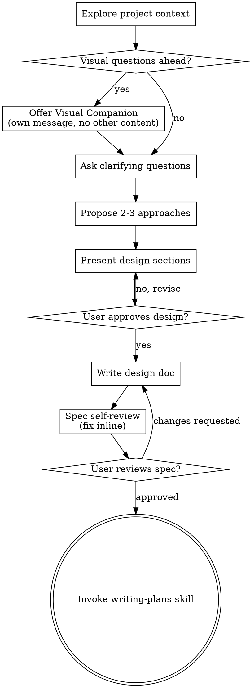

# 将创意头脑风暴为设计

通过自然的协作对话帮助将创意转化为完整的设计和规范。

首先了解当前项目上下文，然后逐个提问以完善创意。一旦理解了要构建的内容，展示设计并获得用户批准。

<HARD-GATE>
在展示设计并获得用户批准之前，不要调用任何实施 skill、编写任何代码、搭建任何项目或采取任何实施行动。这适用于每个项目，无论它看起来多么简单。
</HARD-GATE>

## 反模式："这太简单了，不需要设计"

每个项目都要经过这个过程。待办事项列表、单功能工具、配置更改——所有项目都是如此。"简单"项目是最容易被未审视的假设导致浪费工作的地方。设计可以很短（对于真正简单的项目只需几句话），但你必须展示它并获得批准。

## 检查清单

你必须为以下每个项目创建一个任务并按顺序完成：

1. **探索项目上下文**——检查文件、文档、最近的提交
2. **提供视觉伴侣**（如果主题涉及视觉问题）——这是它自己的消息，不与澄清问题结合。见下面的视觉伴侣部分。
3. **提出澄清问题**——一次一个，理解目的/约束/成功标准
4. **提出 2-3 种方法**——包括权衡和你的推荐
5. **展示设计**——按其复杂性分章节展示，每节后获得用户批准
6. **编写设计文档**——保存到 `docs/superpowers/specs/YYYY-MM-DD-<topic>-design.md` 并提交
7. **规范自审**——快速检查占位符、矛盾、歧义、范围（见下文）
8. **用户审查书面规范**——在继续之前请用户审查规范文件
9. **过渡到实施**——调用 writing-plans skill 创建实施计划

## 流程图

**最终状态是调用 writing-plans。** 不要调用 frontend-design、mcp-builder 或任何其他实施 skill。头脑风暴后唯一调用的 skill 是 writing-plans。

## 流程

**理解创意：**

- 首先检查当前项目状态（文件、文档、最近的提交）
- 在提出详细问题之前，评估范围：如果请求描述了多个独立的子系统（例如，"构建一个带有聊天、文件存储、计费和分析的平台"），立即标记这一点。不要花时间细化需要先分解的项目细节。
- 如果项目对于单个规范来说太大，帮助用户将其分解为子项目：独立的部分是什么，它们如何关联，应该按什么顺序构建？然后通过正常设计流程头脑风暴第一个子项目。每个子项目都有自己的规范→计划→实施周期。
- 对于范围适当的项目，逐个提问以完善创意
- 尽可能使用选择题，但开放式问题也可以
- 每条消息只问一个问题——如果某个主题需要更多探索，将其分解为多个问题
- 专注于理解：目的、约束、成功标准

**探索方法：**

- 提出 2-3 种不同的方法及其权衡
- 以对话方式展示选项，包括你的推荐和推理
- 首先展示你推荐的选项并解释原因

**展示设计：**

- 一旦你理解了要构建的内容，就展示设计
- 根据复杂性缩放每个部分：如果是直接的，用几句话；如果是微妙的，最多 200-300 字
- 在每节后询问目前看起来是否正确
- 涵盖：架构、组件、数据流、错误处理、测试
- 准备回去澄清，如果某些内容不合理

**为隔离和清晰性而设计：**

- 将系统分解为更小的单元，每个单元都有一个明确的目的，通过定义良好的接口通信，可以独立理解和测试
- 对于每个单元，你应该能够回答：它做什么，如何使用它，它依赖于什么
- 有人能否在不阅读其内部的情况下理解单元的作用？你能否在不破坏使用者的情况下更改内部？如果不能，边界需要改进。
- 更小、边界良好的单元也更容易让你使用——你可以更好地推理一次可以保持在上下文中的代码，当文件专注时，你的编辑更可靠。当文件变大时，这通常是它做太多的信号。

**在现有代码库中工作：**

- 在提出更改之前探索当前结构。遵循现有模式。
- 当现有代码存在问题影响工作时（例如，文件太大、边界不清、职责纠缠），将针对性的改进作为设计的一部分——就像优秀开发者在工作中改进代码一样。
- 不要提出无关的重构。专注于服务当前目标。

## 设计之后

**文档化：**

- 将经过验证的设计（规范）写入 `docs/superpowers/specs/YYYY-MM-DD-<topic>-design.md`
  - （用户对规范位置的偏好覆盖此默认值）
- 如果可用，使用 elements-of-style:writing-clearly-and-concisely skill
- 将设计文档提交到 git

**规范自审：**
编写规范文档后，以新的眼光查看它：

1. **占位符扫描：** 任何 "TBD"、"TODO"、不完整的部分或模糊的要求？修复它们。
2. **内部一致性：** 任何部分是否相互矛盾？架构是否与功能描述匹配？
3. **范围检查：** 这是否足够专注于单个实施计划，还是需要分解？
4. **歧义检查：** 任何要求是否可以有两种解释方式？如果是，选择一个并使其明确。

立即修复任何问题。无需重新审查——只需修复并继续。

**用户审查关卡：**
规范审查循环通过后，请用户在继续之前审查书面规范：

> "规范已编写并提交到 `<path>`。请审查它，在开始编写实施计划之前告诉我是否要进行任何更改。"

等待用户的响应。如果他们要求更改，进行更改并重新运行规范审查循环。只有在用户批准后才继续。

**实施：**

- 调用 writing-plans skill 创建详细的实施计划
- 不要调用任何其他 skill。writing-plans 是下一步。

## 核心原则

- **一次一个问题**——不要用多个问题压倒用户
- **首选选择题**——尽可能比开放式问题更容易回答
- **严格遵循 YAGNI**——从所有设计中删除不必要的功能
- **探索替代方案**——在确定之前总是提出 2-3 种方法
- **增量验证**——展示设计，在继续之前获得批准
- **灵活**——当某些内容不合理时，回去澄清

## 视觉伴侣

基于浏览器的伴侣，用于在头脑风暴期间展示模型、图表和视觉选项。作为工具可用——不是模式。接受伴侣意味着它可用于受益于视觉处理的问题；这并不意味着每个问题都通过浏览器。

**提供伴侣：** 当你预期即将出现的问题将涉及视觉内容（模型、布局、图表）时，一次性征求同意：

> "如果我能通过网络浏览器向你展示，我们正在处理的一些内容可能更容易解释。我可以随时制作模型、图表、比较和其他视觉效果。这个功能还是新的，可能会消耗大量 token。想试试吗？（需要打开本地 URL）"

**此提议必须是它自己的消息。** 不要将其与澄清问题、上下文摘要或任何其他内容结合。消息应仅包含上述提议，没有其他内容。在继续之前等待用户的响应。如果他们拒绝，继续纯文本头脑风暴。

**逐问题决策：** 即使用户接受后，对每个问题决定是使用浏览器还是终端。测试标准：**用户通过看到它而不是阅读它来更好地理解这一点吗？**

- **对视觉内容使用浏览器**——模型、线框图、布局比较、架构图表、并排视觉设计
- **对文本内容使用终端**——需求问题、概念选择、权衡列表、A/B/C/D 文本选项、范围决策

关于 UI 主题的问题不一定是视觉问题。"人格在这种语境下意味着什么？"是一个概念问题——使用终端。"哪种向导布局效果更好？"是一个视觉问题——使用浏览器。

如果他们同意伴侣，在继续之前阅读详细指南：
`skills/brainstorming/visual-companion.md`
