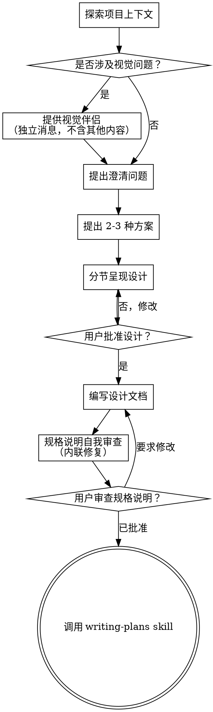

# 将想法通过头脑风暴转化为设计

通过自然的协作对话，帮助将想法转化为完整的设计和规格说明。

首先了解当前项目上下文，然后一次提出一个问题来完善想法。一旦你理解了要构建什么，就呈现设计并获取用户批准。

<HARD-GATE>
在呈现设计并获取用户批准之前，不要调用任何实现 skill、编写任何代码、搭建任何项目或采取任何实现操作。这适用于每个项目，无论其看起来多么简单。
</HARD-GATE>

## 反模式："这太简单了，不需要设计"

每个项目都要经历这个流程。待办事项列表、单函数工具、配置更改——全部都要。"简单"的项目正是未经审视的假设导致最多返工的地方。设计可以很短（真正简单的项目只需要几句话），但你必须在呈现设计后获取批准。

## 检查清单

你必须为以下每一项创建任务并按顺序完成：

1. **探索项目上下文** — 检查文件、文档、最近的提交
2. **提供视觉伴侣**（如果主题涉及视觉问题）— 这是独立的一条消息，不要与澄清问题合并。参见下方的视觉伴侣章节。
3. **提出澄清问题** — 一次一个，理解目的/约束/成功标准
4. **提出 2-3 种方案** — 包含权衡和你的建议
5. **呈现设计** — 按复杂度分节呈现，每节后获取用户批准
6. **编写设计文档** — 保存到 `docs/superpowers/specs/YYYY-MM-DD-<topic>-design.md` 并提交
7. **规格说明自我审查** — 快速内联检查占位符、矛盾、歧义、范围（见下方）
8. **用户审查书面规格说明** — 在继续之前请用户审查规格说明文件
9. **过渡到实现** — 调用 writing-plans skill 创建实现计划

## 流程

**终态是调用 writing-plans。** 不要调用 frontend-design、mcp-builder 或任何其他实现 skill。头脑风暴后唯一调用的 skill 是 writing-plans。

## 流程详解

**理解想法：**

- 首先检查当前项目状态（文件、文档、最近的提交）
- 在提出详细问题之前，评估范围：如果请求描述了多个独立子系统（例如"构建一个包含聊天、文件存储、计费和分析的平台"），请立即指出这一点。不要花时间细化一个需要先进行拆分的项目的细节。
- 如果项目对于单个规格说明来说太大，请帮助用户拆分为子项目：独立的部分有哪些，它们之间如何关联，构建顺序是什么？然后按照正常的设计流程对第一个子项目进行头脑风暴。每个子项目都有各自的规格说明 → 计划 → 实现循环。
- 对于范围适当的项目，一次提出一个问题来完善想法
- 尽可能优先使用选择题，但开放式问题也可以
- 每条消息只提一个问题——如果某个主题需要更多探索，将其分解为多个问题
- 专注于理解：目的、约束、成功标准

**探索方案：**

- 提出 2-3 种不同的方案并说明各自的权衡
- 以对话方式呈现选项，附上你的建议和理由
- 首先呈现你推荐的方案并解释原因

**呈现设计：**

- 一旦你认为自己理解了要构建什么，就呈现设计
- 根据复杂度调整每节的篇幅：如果简单就几句话，如果有细微差别最多 200-300 字
- 每节之后询问到目前为止是否正确
- 涵盖：架构、组件、数据流、错误处理、测试
- 如果某些地方不合理，准备回头澄清

**为隔离性和清晰性而设计：**

- 将系统拆分为更小的单元，每个单元有一个明确的目的，通过定义良好的接口进行通信，并且可以独立理解和测试
- 对于每个单元，你应当能够回答：它做什么，如何使用它，它依赖什么？
- 别人能否在不阅读内部实现的情况下理解一个单元的功能？能否在不破坏消费者的情况下更改内部实现？如果不能，边界需要改进。
- 更小、边界更好的单元也更容易让你处理——你能更好地推理可以一次性放入上下文的代码，当文件聚焦时你的编辑也更可靠。当文件变得很大时，这通常是一个信号，表明它承担了太多职责。

**在现有代码库中工作：**

- 在提出修改之前探索现有结构。遵循现有模式。
- 当现有代码存在影响当前工作的问题时（例如，文件过于庞大、边界不清、职责混乱），将针对性改进作为设计的一部分——就像一个优秀的开发者在改进他们所工作的代码那样。
- 不要提出无关的重构。专注于服务于当前目标的内容。

## 设计之后

**文档化：**

- 将验证后的设计（规格说明）写入 `docs/superpowers/specs/YYYY-MM-DD-<topic>-design.md`
  - （用户对规格说明位置的偏好会覆盖此默认值）
- 如果可用，使用 elements-of-style:writing-clearly-and-concisely skill
- 将设计文档提交到 git

**规格说明自我审查：**
编写完规格说明文档后，用新的眼光审视它：

1. **占位符扫描：** 有没有"TBD"、"TODO"、不完整的章节或模糊的需求？修复它们。
2. **内部一致性：** 各章节之间是否存在矛盾？架构是否与功能描述匹配？
3. **范围检查：** 这是否聚焦到足以对应单个实现计划，还是需要进一步拆分？
4. **歧义检查：** 是否有任何需求可以被两种不同方式解读？如果有，选择一种并明确表达。

内联修复任何问题。无需重新审查——只需修复然后继续。

**用户审查关卡：**
在规格说明审查循环通过后，在继续之前请用户审查书面规格说明：

> "规格说明已编写并提交至 `<路径>`。请审查它，如果在开始编写实现计划之前需要做任何修改，请告诉我。"

等待用户的回复。如果他们要求修改，进行修改并重新运行规格说明审查循环。只有在用户批准后才继续。

**实现：**

- 调用 writing-plans skill 来创建详细的实现计划
- 不要调用任何其他 skill。writing-plans 是下一步。

## 关键原则

- **一次一个问题** — 不要用多个问题压倒用户
- **优先选择题** — 可能的情况下比开放式问题更容易回答
- **果断应用 YAGNI** — 从所有设计中移除不必要的功能
- **探索替代方案** — 在确定之前始终提出 2-3 种方案
- **渐进式验证** — 呈现设计，在继续之前获取批准
- **保持灵活** — 当某些东西不合理时回头澄清

## 视觉伴侣

一个基于浏览器的伴侣工具，用于在头脑风暴过程中展示 mockup、图表和视觉选项。作为工具而非模式使用。接受伴侣意味着它可以用于那些能从视觉处理中获益的问题；这并不意味着每个问题都要通过浏览器。

**提供伴侣：** 当你预期接下来的问题会涉及视觉内容（mockup、布局、图表）时，提供一次以获取同意：
> "我们正在处理的一些内容，如果能在浏览器中展示给你看，可能会更容易解释。我可以随着进展搭建 mockup、图表、对比和其他视觉内容。这个功能还比较新，可能会消耗较多 token。想试试吗？（需要打开一个本地 URL）"

**这个提议必须是独立的一条消息。** 不要与澄清问题、上下文摘要或任何其他内容合并。这条消息应该只包含上述提议，不能有其他内容。等待用户回复后再继续。如果他们拒绝，则只使用文本进行头脑风暴。

**逐问题决策：** 即使用户接受了，也要针对每个问题决定使用浏览器还是终端。测试标准是：**用户通过观看比通过阅读能更好地理解这个内容吗？**

- **使用浏览器** 展示本质上属于视觉的内容 — mockup、线框图、布局对比、架构图、并排视觉设计
- **使用终端** 展示文本内容 — 需求问题、概念选择、权衡列表、A/B/C/D 文本选项、范围决策

关于 UI 主题的问题不一定自动是视觉问题。"在这种语境下'个性'是什么意思？"是一个概念性问题——使用终端。"哪个向导布局更好？"是一个视觉问题——使用浏览器。

如果他们同意使用伴侣，在继续之前阅读详细指南：
`skills/brainstorming/visual-companion.md`
