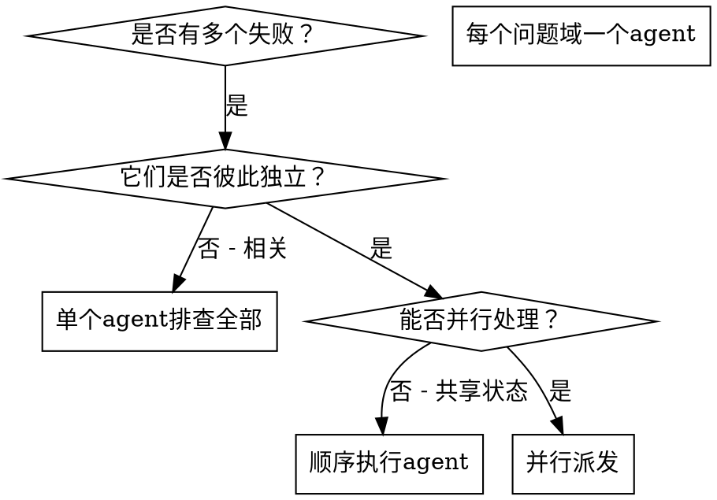

# 并行派发 Agent

## 概述

你将任务委派给具有隔离上下文的专用 agent。通过精确地构建其指令和上下文，确保它们能保持专注并成功完成任务。它们绝不应继承你当前会话的上下文或历史记录——你只需要构建它们所需的内容即可。这样也能为你自己保留上下文用于协调工作。

当你遇到多个不相关的失败（不同的测试文件、不同的子系统、不同的 bug）时，逐一排查会浪费时间。每个排查工作都是独立的，可以并行进行。

**核心原则：** 为每个独立的问题域派发一个 agent，让它们并发工作。

## 适用场景



**适用情况：**
- 3 个或更多测试文件因不同根因而失败
- 多个子系统各自独立损坏
- 每个问题可以在不了解其他问题的上下文的情况下被理解
- 排查工作之间没有共享状态

**不适用情况：**
- 失败彼此相关（修复一个可能会修复其他）
- 需要了解完整的系统状态
- Agent 之间会互相干扰

## 操作模式

### 1. 识别独立的问题域

按故障模块对失败进行分组：
- 文件 A 测试：工具审批流程
- 文件 B 测试：批量完成行为
- 文件 C 测试：中止功能

每个域都是独立的——修复工具审批不会影响中止测试。

### 2. 创建聚焦的 Agent 任务

每个 agent 获得：
- **明确范围：** 一个测试文件或子系统
- **清晰目标：** 让这些测试通过
- **约束条件：** 不要修改其他代码
- **期望输出：** 发现和修复内容的摘要

### 3. 并行派发

```typescript
// 在 Claude Code / AI 环境中
Task("修复 agent-tool-abort.test.ts 的失败")
Task("修复 batch-completion-behavior.test.ts 的失败")
Task("修复 tool-approval-race-conditions.test.ts 的失败")
// 三者并发运行
```

### 4. 审查与整合

当 agent 返回结果后：
- 阅读每个摘要
- 验证各修复之间没有冲突
- 运行完整的测试套件
- 整合所有变更

## Agent Prompt 结构

好的 agent prompt 具备以下特征：
1. **聚焦**——一个清晰的问题域
2. **自包含**——理解问题所需的全部上下文
3. **输出明确**——agent 应返回什么？

```markdown
修复 src/agents/agent-tool-abort.test.ts 中的 3 个失败测试：

1. "should abort tool with partial output capture" - 期望消息中包含 'interrupted at'
2. "should handle mixed completed and aborted tools" - 快速工具被中止而非完成
3. "should properly track pendingToolCount" - 期望 3 个结果但得到 0

这些是时序/竞态条件问题。你的任务：

1. 阅读测试文件，理解每个测试验证的内容
2. 识别根因——是时序问题还是实际 bug？
3. 修复方式：
   - 用基于事件的等待替换任意超时
   - 如果发现中止实现中的 bug，则修复它们
   - 如果测试的是已变更的行为，则调整测试预期

不要只是增大超时值——找出真正的问题。

返回：发现内容和修复内容的摘要。
```

## 常见错误

**❌ 范围太宽：** "修复所有测试"——agent 会不知所措
**✅ 具体明确：** "修复 agent-tool-abort.test.ts"——范围聚焦

**❌ 缺少上下文：** "修复竞态条件"——agent 不知道在哪里
**✅ 提供上下文：** 粘贴错误信息和测试名称

**❌ 无约束：** Agent 可能会重构所有内容
**✅ 有约束：** "不要修改生产代码"或"仅修复测试"

**❌ 输出模糊：** "修好它"——你不知道改了什么
**✅ 明确输出：** "返回根因和变更的摘要"

## 何时不应使用

**失败相关：** 修复一个可能会修复其他——先一起排查
**需要完整上下文：** 理解问题需要看到整个系统
**探索性调试：** 你还不清楚哪里出了问题
**共享状态：** Agent 会互相干扰（编辑相同文件、使用相同资源）

## 真实会话示例

**场景：** 重大重构后，3 个文件中共有 6 个测试失败

**失败情况：**
- agent-tool-abort.test.ts：3 个失败（时序问题）
- batch-completion-behavior.test.ts：2 个失败（工具未执行）
- tool-approval-race-conditions.test.ts：1 个失败（执行次数 = 0）

**决策：** 独立的问题域——中止逻辑、批量完成和竞态条件互不依赖

**派发：**
```
Agent 1 → 修复 agent-tool-abort.test.ts
Agent 2 → 修复 batch-completion-behavior.test.ts
Agent 3 → 修复 tool-approval-race-conditions.test.ts
```

**结果：**
- Agent 1：用基于事件的等待替换了超时
- Agent 2：修复了事件结构 bug（threadId 位置错误）
- Agent 3：添加了对异步工具执行完成的等待

**整合：** 所有修复彼此独立，无冲突，完整套件通过

**节省时间：** 3 个问题并行解决 vs 顺序解决

## 核心优势

1. **并行化**——多个排查同时进行
2. **聚焦**——每个 agent 范围狭窄，需要跟踪的上下文更少
3. **独立性**——Agent 之间不会互相干扰
4. **速度**——3 个问题用解决 1 个问题的时间完成

## 验证

Agent 返回后：
1. **审查每个摘要**——理解改了什么
2. **检查冲突**——Agent 是否编辑了相同的代码？
3. **运行完整套件**——验证所有修复能协同工作
4. **抽查**——Agent 可能会犯系统性错误

## 真实影响

来自某次调试会话（2025-10-03）：
- 3 个文件共 6 个失败
- 3 个 agent 并行派发
- 所有排查并发完成
- 所有修复成功整合
- Agent 变更之间零冲突
