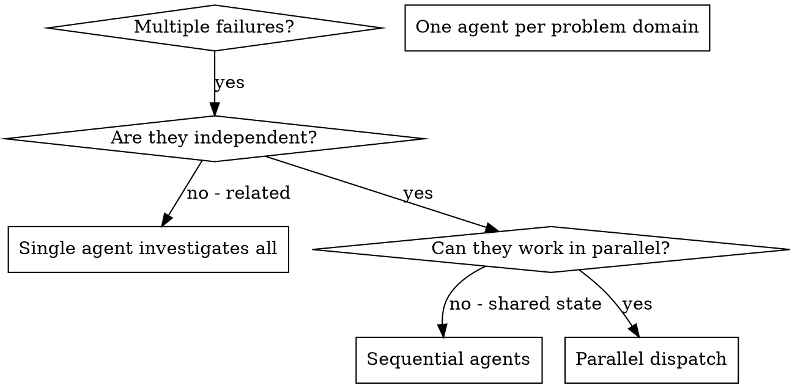

# 派发并行 Agent

## 概述

你将任务委托给具有隔离上下文的专用 agent。通过精心制作他们的指令和上下文，你确保他们保持专注并成功完成任务。他们永远不应该继承你的会话上下文或历史记录——你构建他们需要的确切内容。这也为你自己的上下文保留了协调工作。

当你有多个不相关的失败（不同的测试文件、不同的子系统、不同的 bug）时，顺序调查会浪费时间。每个调查都是独立的，可以并行进行。

**核心原则：** 为每个独立问题域派发一个 agent。让他们并发工作。

## 何时使用



**使用时机：**
- 3+ 个测试文件失败，根本原因不同
- 多个子系统独立损坏
- 每个问题都可以在没有其他上下文的情况下理解
- 调查之间没有共享状态

**不要使用时机：**
- 失败相关（修复一个可能修复其他）
- 需要理解完整的系统状态
- Agent 会相互干扰

## 模式

### 1. 识别独立域

按损坏的内容分组失败：
- 文件 A 测试：工具批准流程
- 文件 B 测试：批处理完成行为
- 文件 C 测试：中止功能

每个域都是独立的——修复工具批准不会影响中止测试。

### 2. 创建专注的 Agent 任务

每个 agent 获得：
- **特定范围：** 一个测试文件或子系统
- **明确目标：** 使这些测试通过
- **约束：** 不要更改其他代码
- **预期输出：** 你发现和修复的内容摘要

### 3. 并行派发

```typescript
// 在 Claude Code / AI 环境中
Task("Fix agent-tool-abort.test.ts failures")
Task("Fix batch-completion-behavior.test.ts failures")
Task("Fix tool-approval-race-conditions.test.ts failures")
// 所有三个并发运行
```

### 4. 审查和集成

当 agent 返回时：
- 阅读每个摘要
- 验证修复不冲突
- 运行完整的测试套件
- 集成所有更改

## Agent 提示结构

好的 agent 提示是：
1. **专注**——一个明确的问题域
2. **自包含**——理解问题所需的所有上下文
3. **输出具体**——agent 应该返回什么？

```markdown
修复 src/agents/agent-tool-abort.test.ts 中 3 个失败的测试：

1. "should abort tool with partial output capture" - 期望消息中有 'interrupted at'
2. "should handle mixed completed and aborted tools" - 快速工具被中止而不是完成
3. "should properly track pendingToolCount" - 期望 3 个结果但得到 0

这些是时序/竞争条件问题。你的任务：

1. 阅读测试文件并理解每个测试验证的内容
2. 识别根本原因——时序问题还是实际 bug？
3. 通过以下方式修复：
   - 用基于事件的等待替换任意超时
   - 如果在中止实现中发现 bug，请修复
   - 如果测试更改的行为，则调整测试期望

不要只是增加超时——找到真正的问题。

返回：你发现和修复的内容摘要。
```

## 常见错误

**❌ 太宽泛：** "修复所有测试"——agent 迷失了
**✅ 具体：** "修复 agent-tool-abort.test.ts"——专注的范围

**❌ 无上下文：** "修复竞争条件"——agent 不知道在哪里
**✅ 上下文：** 粘贴错误消息和测试名称

**❌ 无约束：** Agent 可能会重构所有内容
**✅ 约束：** "不要更改生产代码" 或 "仅修复测试"

**❌ 输出模糊：** "修复它"——你不知道改变了什么
**✅ 具体：** "返回根本原因和更改的摘要"

## 何时不使用

**相关失败：** 修复一个可能修复其他——首先一起调查
**需要完整上下文：** 理解需要查看整个系统
**探索性调试：** 你还不知道什么坏了
**共享状态：** Agent 会相互干扰（编辑相同的文件、使用相同的资源）

## 会话中的真实示例

**场景：** 重大重构后 3 个文件中有 6 个测试失败

**失败：**
- agent-tool-abort.test.ts：3 个失败（时序问题）
- batch-completion-behavior.test.ts：2 个失败（工具未执行）
- tool-approval-race-conditions.test.ts：1 个失败（执行计数 = 0）

**决策：** 独立域——中止逻辑与批处理完成与竞争条件分离

**派发：**
```
Agent 1 → 修复 agent-tool-abort.test.ts
Agent 2 → 修复 batch-completion-behavior.test.ts
Agent 3 → 修复 tool-approval-race-conditions.test.ts
```

**结果：**
- Agent 1：用基于事件的等待替换超时
- Agent 2：修复事件结构 bug（threadId 在错误的位置）
- Agent 3：添加等待以完成异步工具执行

**集成：** 所有修复都是独立的，没有冲突，完整套件通过

**节省的时间：** 3 个问题并行解决与顺序解决

## 主要好处

1. **并行化**——多个调查同时进行
2. **专注**——每个 agent 的范围狭窄，需要跟踪的上下文更少
3. **独立性**——Agent 不会相互干扰
4. **速度**——在 1 个的时间内解决 3 个问题

## 验证

Agent 返回后：
1. **审查每个摘要**——理解改变了什么
2. **检查冲突**——Agent 是否编辑了相同的代码？
3. **运行完整套件**——验证所有修复一起工作
4. **抽查**——Agent 可能会犯系统性错误

## 真实世界影响

从调试会话（2025-10-03）：
- 3 个文件中有 6 个失败
- 3 个 agent 并行派发
- 所有调查并发完成
- 所有修复成功集成
- Agent 更改之间零冲突
