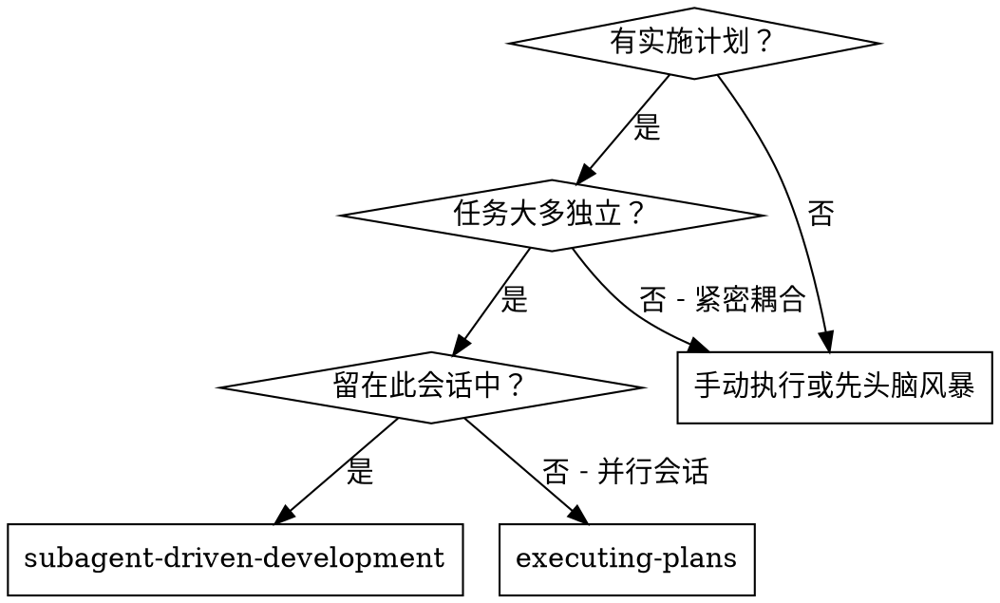
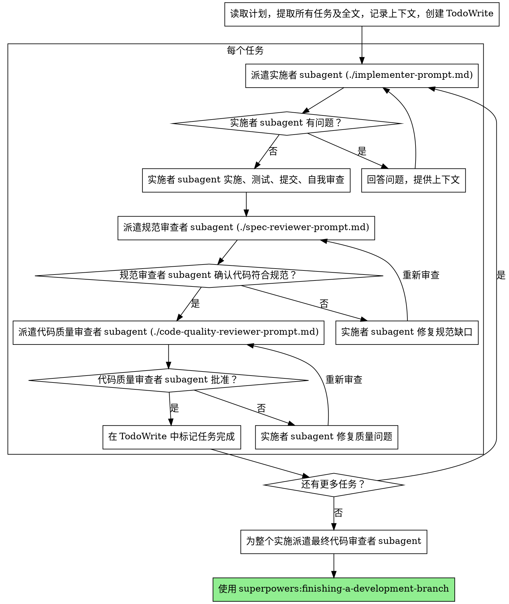

# Subagent-Driven Development

通过为每个任务派遣新的 subagent 来执行计划，每个任务后进行两阶段审查：首先是规范合规性审查，然后是代码质量审查。

**为什么使用 subagent：** 你将任务委托给具有隔离上下文的专门 agent。通过精确制作它们的指令和上下文，你确保它们保持专注并成功完成任务。它们永远不应该继承你会话的上下文或历史记录——你构建它们确切需要的内容。这也保留你自己的上下文用于协调工作。

**核心原则：** 每个任务使用新的 subagent + 两阶段审查（先规范后质量）= 高质量，快速迭代

**持续执行：** 不要在任务之间暂停以与你的人类搭档确认。执行计划中的所有任务而不停止。唯一的停止原因是：你无法解决的 BLOCKED 状态、真正阻止进展的模糊性，或所有任务完成。"我应该继续吗？"提示和进度总结浪费他们的时间——他们要求你执行计划，所以执行它。

## 何时使用



**与执行计划（并行会话）相比：**
- 同一会话（无上下文切换）
- 每个任务使用新的 subagent（无上下文污染）
- 每个任务后进行两阶段审查：先规范合规性，然后代码质量
- 更快的迭代（任务之间无需人工介入）

## 流程



## 模型选择

使用能够处理每个角色的最不强大的模型以节省成本并提高速度。

**机械实施任务**（隔离函数、清晰规范、1-2 个文件）：使用快速、便宜的模型。当计划明确指定时，大多数实施任务是机械的。

**集成和判断任务**（多文件协调、模式匹配、调试）：使用标准模型。

**架构、设计和审查任务**：使用最强大的可用模型。

**任务复杂性信号：**
- 触及 1-2 个文件且具有完整规范 → 便宜模型
- 触及多个文件且有集成关注点 → 标准模型
- 需要设计判断或广泛代码库理解 → 最强大模型

## 处理实施者状态

实施者 subagent 报告四种状态之一。适当处理每种状态：

**DONE：** 继续进行规范合规性审查。

**DONE_WITH_CONCERNS：** 实施者完成了工作但标记了疑虑。在继续之前阅读关注点。如果关注点是关于正确性或范围，在审查之前解决它们。如果它们是观察（例如，"这个文件越来越大了"），记录它们并继续审查。

**NEEDS_CONTEXT：** 实施者需要未提供的信息。提供缺失的上下文并重新派遣。

**BLOCKED：** 实施者无法完成任务。评估阻塞器：
1. 如果是上下文问题，提供更多上下文并使用相同模型重新派遣
2. 如果任务需要更多推理，使用更强大的模型重新派遣
3. 如果任务太大，将其分解为更小的部分
4. 如果计划本身错误，升级给人类

**绝不** 忽略升级或强制相同模型在没有更改的情况下重试。如果实施者说它卡住了，某些东西需要改变。

## Prompt 模板

- `./implementer-prompt.md` - 派遣实施者 subagent
- `./spec-reviewer-prompt.md` - 派遣规范合规性审查者 subagent
- `./code-quality-reviewer-prompt.md` - 派遣代码质量审查者 subagent

## 示例工作流

```
你：我正在使用 Subagent-Driven Development 来执行此计划。

[读取计划文件一次：docs/superpowers/plans/feature-plan.md]
[提取所有 5 个任务及全文和上下文]
[使用所有任务创建 TodoWrite]

任务 1：Hook 安装脚本

[获取任务 1 文本和上下文（已提取）]
[派遣实施 subagent 并附带完整任务文本 + 上下文]

实施者："开始之前 - hook 应该安装在用户级别还是系统级别？"

你："用户级别（~/.config/superpowers/hooks/）"

实施者："明白了。现在正在实施..."
[稍后] 实施者：
  - 实施了 install-hook 命令
  - 添加了测试，5/5 通过
  - 自我审查：发现我遗漏了 --force 标志，已添加
  - 已提交

[派遣规范合规性审查者]
规范审查者：✅ 符合规范 - 满足所有要求，没有额外内容

[获取 git SHA，派遣代码质量审查者]
代码审查者：优势：良好的测试覆盖，干净。问题：无。已批准。

[标记任务 1 完成]

任务 2：恢复模式

[获取任务 2 文本和上下文（已提取）]
[派遣实施 subagent 并附带完整任务文本 + 上下文]

实施者：[没有问题，继续]
实施者：
  - 添加了 verify/repair 模式
  - 8/8 测试通过
  - 自我审查：一切良好
  - 已提交

[派遣规范合规性审查者]
规范审查者：❌ 发现问题：
  - 缺失：进度报告（规范说"每 100 项报告一次"）
  - 额外：添加了 --json 标志（未请求）

[实施者修复问题]
实施者：删除了 --json 标志，添加了进度报告

[规范审查者再次审查]
规范审查者：✅ 现在符合规范

[派遣代码质量审查者]
代码审查者：优势：扎实。问题（重要）：魔术数字（100）

[实施者修复]
实施者：提取了 PROGRESS_INTERVAL 常量

[代码审查者再次审查]
代码审查者：✅ 已批准

[标记任务 2 完成]

...

[所有任务后]
[派遣最终代码审查者]
最终审查者：满足所有要求，可以合并

完成！
```

## 优势

**与手动执行相比：**
- Subagent 自然遵循 TDD
- 每个任务的新上下文（无混淆）
- 并行安全（subagent 不干扰）
- Subagent 可以提问（工作之前和工作期间）

**与执行计划相比：**
- 同一会话（无交接）
- 持续进展（无需等待）
- 审查检查点自动

**效率增益：**
- 无文件读取开销（控制器提供全文）
- 控制器精确策划需要的上下文
- Subagent 前端获得完整信息
- 问题在工作开始前浮现（而不是之后）

**质量关卡：**
- 自我审查在交接前捕获问题
- 两阶段审查：规范合规性，然后代码质量
- 审查循环确保修复真正有效
- 规范合规性防止过度/不足构建
- 代码质量确保实施构建良好

**成本：**
- 更多的 subagent 调用（每个任务实施者 + 2 个审查者）
- 控制器做更多准备工作（提前提取所有任务）
- 审查循环增加迭代
- 但早期捕获问题（比以后调试更便宜）

## 警示信号

**绝不：**
- 在没有明确用户同意的情况下在 main/master 分支上开始实施
- 跳过审查（规范合规性或代码质量）
- 在未修复问题的情况下继续
- 并行派遣多个实施 subagent（冲突）
- 让 subagent 读取计划文件（改为提供全文）
- 跳过场景设置上下文（subagent 需要理解任务适合位置）
- 忽略 subagent 问题（在让它们继续之前回答）
- 接受规范合规性的"足够接近"（规范审查发现问题 = 未完成）
- 跳过审查循环（审查发现问题 = 实施者修复 = 再次审查）
- 让实施者自我审查替代实际审查（两者都需要）
- **在规范合规性 ✅ 之前开始代码质量审查**（错误顺序）
- 在任一审查有未解决问题时移动到下一个任务

**如果 subagent 有问题：**
- 清晰完整地回答
- 如果需要提供额外上下文
- 不要催促它们进入实施

**如果审查发现问题：**
- 实施者（同一 subagent）修复它们
- 审查者再次审查
- 重复直到批准
- 不要跳过重新审查

**如果 subagent 任务失败：**
- 派遣修复 subagent 并附带具体指令
- 不要尝试手动修复（上下文污染）

## 集成

**必需的工作流 skill：**
- **superpowers:using-git-worktrees** - 确保隔离的工作区（创建一个或验证现有的）
- **superpowers:writing-plans** - 创建此 skill 执行的计划
- **superpowers:requesting-code-review** - 审查者 subagent 的代码审查模板
- **superpowers:finishing-a-development-branch** - 所有任务后完成开发

**Subagent 应该使用：**
- **superpowers:test-driven-development** - Subagent 对每个任务遵循 TDD

**替代工作流：**
- **superpowers:executing-plans** - 用于并行会话而不是同会话执行
