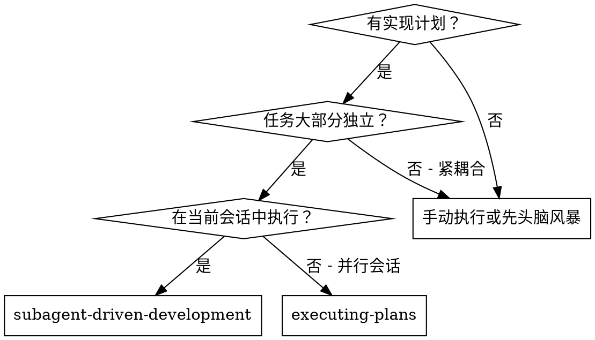
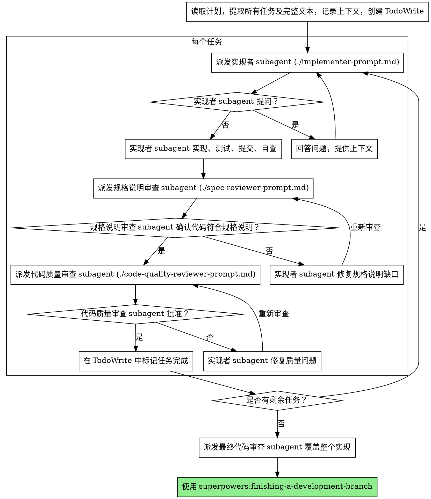

# Subagent 驱动的开发

通过每个任务派发全新的 subagent 来执行计划，每个任务后进行两阶段审查：先规格说明合规审查，再代码质量审查。

**为什么使用 subagent：** 你将任务委派给拥有隔离上下文的专用 agent。通过精确构建它们的指令和上下文，你能确保它们保持专注并成功完成任务。它们永远不应继承你会话的上下文或历史记录——你只构建它们所需要的内容。这也能为你自己的上下文保留空间以进行协调工作。

**核心原则：** 每个任务使用全新 subagent + 两阶段审查（先规格说明后质量）= 高质量、快速迭代

**持续执行：** 不要在任务之间停下来向你的 人类搭档 汇报。执行计划中的所有任务，不要间断。唯一需要暂停的理由是：你无法解决的 BLOCKED 状态、真正阻碍进展的歧义，或所有任务已完成。"我应该继续吗？"之类的提示和进度摘要浪费他们的时间——他们要求你执行计划，那就执行到底。

## 何时使用



**vs. 执行计划（并行会话）：**
- 同一会话（无上下文切换）
- 每个任务使用全新 subagent（无上下文污染）
- 每个任务后两阶段审查：先规格说明合规，再代码质量
- 更快迭代（任务之间无需人工介入）

## 流程



## 模型选择

使用能够处理每个角色的最弱模型，以节约成本并提高速度。

**机械性实现任务**（独立函数、明确的规格说明、1-2 个文件）：使用快速、廉价的模型。当计划制定得当，大多数实现任务都是机械性的。

**集成与判断任务**（多文件协调、模式匹配、调试）：使用标准模型。

**架构、设计和审查任务**：使用最强可用的模型。

**任务复杂度信号：**
- 涉及 1-2 个文件且有完整规格说明 → 廉价模型
- 涉及多个文件且有集成关注点 → 标准模型
- 需要设计判断或广泛的代码库理解 → 最强模型

## 处理实现者状态

实现者 subagent 报告四种状态之一。分别恰当处理：

**DONE：** 进入规格说明合规审查。

**DONE_WITH_CONCERNS：** 实现者完成了工作但标记了疑虑。在继续之前阅读这些疑虑。如果疑虑涉及正确性或范围，在审查之前处理它们。如果只是观察性意见（例如"这个文件正在变得很大"），记录下来并进入审查。

**NEEDS_CONTEXT：** 实现者需要未提供的信息。提供缺失的上下文并重新派发。

**BLOCKED：** 实现者无法完成任务。评估阻塞原因：
1. 如果是上下文问题，提供更多上下文并使用同一模型重新派发
2. 如果任务需要更多推理能力，使用更强的模型重新派发
3. 如果任务太大，将其拆分成更小的部分
4. 如果计划本身有问题，升级给 人类搭档

**绝不要**忽略升级或强迫同一个模型不做改变就重试。如果实现者说卡住了，就需要有所改变。

## Prompt 模板

- `./implementer-prompt.md` - 派发实现者 subagent
- `./spec-reviewer-prompt.md` - 派发规格说明合规审查 subagent
- `./code-quality-reviewer-prompt.md` - 派发代码质量审查 subagent

## 示例工作流

```
你：我正在使用 Subagent 驱动的开发来执行此计划。

[读取一次计划文件：docs/superpowers/plans/feature-plan.md]
[提取所有 5 个任务及完整文本和上下文]
[创建 TodoWrite 列出所有任务]

任务 1：Hook 安装脚本

[获取任务 1 的文本和上下文（已提取）]
[派发实现 subagent，附上完整任务文本 + 上下文]

实现者："在开始之前——hook 应该安装在用户级别还是系统级别？"

你："用户级别 (~/.config/superpowers/hooks/)"

实现者："明白了。现在开始实现..."
[稍后] 实现者：
  - 实现了 install-hook 命令
  - 添加了测试，5/5 通过
  - 自查：发现遗漏了 --force 标志，已添加
  - 已提交

[派发规格说明合规审查 subagent]
规格说明审查者：✅ 规格说明合规 - 所有需求已满足，没有多余内容

[获取 git SHA，派发代码质量审查 subagent]
代码审查者：优点：测试覆盖良好，代码干净。问题：无。已批准。

[标记任务 1 完成]

任务 2：恢复模式

[获取任务 2 的文本和上下文（已提取）]
[派发实现 subagent，附上完整任务文本 + 上下文]

实现者：[无问题，继续执行]
实现者：
  - 添加了 verify/repair 模式
  - 8/8 测试通过
  - 自查：一切正常
  - 已提交

[派发规格说明合规审查 subagent]
规格说明审查者：❌ 问题：
  - 缺失：进度报告（规格说明要求"每 100 项报告一次"）
  - 额外：添加了 --json 标志（未被要求）

[实现者修复问题]
实现者：移除了 --json 标志，添加了进度报告

[规格说明审查者再次审查]
规格说明审查者：✅ 现在规格说明合规

[派发代码质量审查 subagent]
代码审查者：优点：扎实。问题（重要）：魔术数字 (100)

[实现者修复]
实现者：提取了 PROGRESS_INTERVAL 常量

[代码审查者再次审查]
代码审查者：✅ 已批准

[标记任务 2 完成]

...

[所有任务完成后]
[派发最终代码审查 subagent]
最终审查者：所有需求已满足，可以合并

完成！
```

## 优势

**对比手动执行：**
- Subagent 自然地遵循 TDD
- 每个任务有全新上下文（无混淆）
- 并行安全（subagent 不会互相干扰）
- Subagent 可以提问（工作前和工作期间）

**对比执行计划：**
- 同一会话（无需交接）
- 持续进展（无需等待）
- 审查检查点自动化

**效率收益：**
- 无文件读取开销（控制器提供完整文本）
- 控制器精确保全所需的上下文
- Subagent 预先获得完整信息
- 问题在工作开始之前提出（而非之后）

**质量门禁：**
- 自查在交接前捕获问题
- 两阶段审查：先规格说明合规，再代码质量
- 审查循环确保修复确实生效
- 规格说明合规防止过度构建或构建不足
- 代码质量确保实现构建良好

**成本：**
- 更多 subagent 调用（每个任务实现者 + 2 个审查者）
- 控制器做更多准备工作（预先提取所有任务）
- 审查循环增加迭代
- 但早期捕获问题（比后续调试更廉价）

## 红线

**绝不：**
- 在没有明确用户同意的情况下在 main/master 分支上开始实现
- 跳过审查（规格说明合规或代码质量）
- 带着未修复的问题继续
- 并行派发多个实现 subagent（会产生冲突）
- 让 subagent 自行读取计划文件（应提供完整文本）
- 跳过场景设定上下文（subagent 需要了解任务所处位置）
- 忽略 subagent 的问题（在让他们继续之前先回答）
- 在规格说明合规上接受"差不多就行"（规格说明审查者发现问题 = 未完成）
- 跳过审查循环（审查者发现问题 = 实现者修复 = 再次审查）
- 让实现者的自查替代实际审查（两者都需要）
- **在规格说明合规变为 ✅ 之前开始代码质量审查**（顺序错误）
- 在任一审查有未解决问题时进入下一个任务

**如果 subagent 提问：**
- 清晰完整地回答
- 如有需要提供额外上下文
- 不要催促他们进入实现

**如果审查者发现问题：**
- 实现者（同一个 subagent）修复它们
- 审查者再次审查
- 重复直到批准
- 不要跳过重新审查

**如果 subagent 任务失败：**
- 派发修复 subagent，附上具体指令
- 不要尝试手动修复（上下文污染）

## 集成

**必需的工作流 skills：**
- **superpowers:using-git-worktrees** - 确保隔离的工作区（创建一个或验证已有的）
- **superpowers:writing-plans** - 创建此 skill 要执行的计划
- **superpowers:requesting-code-review** - 用于审查者 subagent 的代码审查模板
- **superpowers:finishing-a-development-branch** - 所有任务完成后的开发分支收尾

**Subagent 应使用：**
- **superpowers:test-driven-development** - Subagent 在每个任务中遵循 TDD

**替代工作流：**
- **superpowers:executing-plans** - 用于并行会话而非同一会话执行
