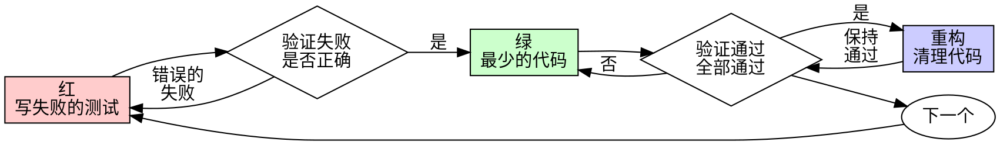

# 测试驱动开发（TDD）

## 概述

先写测试。看它失败。写最少的代码让它通过。

**核心原则：** 如果你没有看到测试失败，你就不知道它测试的是否正确。

**违反规则的文字，就是违反规则的精神。**

## 何时使用

**始终使用：**
- 新功能
- Bug 修复
- 重构
- 行为变更

**例外（询问你的人类搭档）：**
- 一次性原型
- 生成的代码
- 配置文件

想着"就这一次跳过 TDD"？停下来。这是在找借口。

## 铁律

```
没有失败的测试，就没有生产代码
```

在测试之前写了代码？删掉。重新开始。

**没有例外：**
- 不要把它当作"参考"保留
- 不要在写测试时"改编"它
- 不要看它
- 删除就是删除

从测试全新实现。没有商量余地。

## 绿-红-重构



### 红 - 写失败的测试

写一个最小化的测试来展示应该发生什么。

<Good>
```typescript
test('失败的操作重试 3 次', async () => {
  let attempts = 0;
  const operation = () => {
    attempts++;
    if (attempts < 3) throw new Error('fail');
    return 'success';
  };

  const result = await retryOperation(operation);

  expect(result).toBe('success');
  expect(attempts).toBe(3);
});
```
名称清晰，测试真实行为，只测一件事
</Good>

<Bad>
```typescript
test('重试可用', async () => {
  const mock = jest.fn()
    .mockRejectedValueOnce(new Error())
    .mockRejectedValueOnce(new Error())
    .mockResolvedValueOnce('success');
  await retryOperation(mock);
  expect(mock).toHaveBeenCalledTimes(3);
});
```
名称含糊，测试的是 mock 而非代码
</Bad>

**要求：**
- 一个行为
- 名称清晰
- 真实代码（除非不可避免才用 mock）

### 验证红 - 看它失败

**强制执行。绝不跳过。**

```bash
npm test path/to/test.test.ts
```

确认：
- 测试失败（不是错误）
- 失败信息符合预期
- 失败原因是功能缺失（不是拼写错误）

**测试通过了？** 你测试的是已有行为。修正测试。

**测试报错？** 修正错误，重新运行直到它正确地失败。

### 绿 - 最少的代码

写最简单的代码让测试通过。

<Good>
```typescript
async function retryOperation<T>(fn: () => Promise<T>): Promise<T> {
  for (let i = 0; i < 3; i++) {
    try {
      return await fn();
    } catch (e) {
      if (i === 2) throw e;
    }
  }
  throw new Error('unreachable');
}
```
刚好能通过
</Good>

<Bad>
```typescript
async function retryOperation<T>(
  fn: () => Promise<T>,
  options?: {
    maxRetries?: number;
    backoff?: 'linear' | 'exponential';
    onRetry?: (attempt: number) => void;
  }
): Promise<T> {
  // YAGNI
}
```
过度设计
</Bad>

不要添加功能、不要重构其他代码、不要超出测试范围"改进"。

### 验证绿 - 看它通过

**强制执行。**

```bash
npm test path/to/test.test.ts
```

确认：
- 测试通过
- 其他测试仍然通过
- 输出干净（无错误、无警告）

**测试失败？** 修正代码，不是修正测试。

**其他测试失败？** 立即修正。

### 重构 - 清理代码

仅在通过之后：
- 消除重复
- 改善命名
- 提取辅助函数

保持测试通过。不要添加行为。

### 重复

为下一个功能写下一个失败的测试。

## 好的测试

| 质量 | 好 | 坏 |
|---------|------|-----|
| **最小化** | 一件事。名称中有"和"？拆分它。 | `test('验证邮箱和域名和空白字符')` |
| **清晰** | 名称描述行为 | `test('test1')` |
| **展示意图** | 展示期望的 API | 模糊代码应该做什么 |

## 为什么顺序很重要

**"我实现后再写测试来验证它是否可用"**

代码之后写的测试立即通过。立即通过什么都证明不了：
- 可能测试了错误的东西
- 可能测试的是实现，而非行为
- 可能遗漏了你忘记的边界情况
- 你从未看到它捕获到 bug

测试先行迫使你看到测试失败，证明它确实测试了某个东西。

**"我已经手动测试了所有边界情况"**

手动测试是临时的。你以为你测试了一切，但是：
- 没有你测试过什么的记录
- 代码变更时无法重新运行
- 在压力下容易遗漏情况
- "我试的时候是好的" ≠ 全面

自动化测试是系统性的。它们每次都以相同的方式运行。

**"删除 X 小时的工作是浪费"**

沉没成本谬误。时间已经花掉了。你现在选择：
- 删除并用 TDD 重写（再花 X 小时，信心高）
- 保留并在之后加测试（30 分钟，信心低，可能有 bug）

"浪费"的是保留你无法信任的代码。没有真正测试的工作代码就是技术债务。

**"TDD 很教条，务实意味着灵活应变"**

TDD 就是务实的：
- 在提交前发现 bug（比事后调试快）
- 防止回归（测试立即捕获故障）
- 文档化行为（测试展示如何使用代码）
- 支持重构（自由修改，测试捕获故障）

"务实"的捷径 = 在生产中调试 = 更慢。

**"事后测试实现同样的目标——重要的是精神而非仪式"**

不对。事后测试回答"这段代码做什么？"。测试先行回答"这段代码应该做什么？"

事后测试受你的实现影响。你测试的是你构建的东西，而不是需要的东西。你验证的是你记起来的边界情况，而不是发现的边界情况。

测试先行迫使在实现前发现边界情况。事后测试验证你是否记住了所有情况（你没有）。

30 分钟的事后测试 ≠ TDD。你获得了覆盖率，却失去了证明测试有效的证据。

## 常见借口

| 借口 | 现实 |
|--------|---------|
| "太简单了不需要测试" | 简单代码也会出错。测试只需 30 秒。 |
| "我会之后再测试" | 立即通过的测试什么都证明不了。 |
| "事后测试实现同样目标" | 事后测试 = "这段代码做什么？" 测试先行 = "这段代码应该做什么？" |
| "已经手动测试过了" | 临时 ≠ 系统。没有记录，无法重新运行。 |
| "删除 X 小时是浪费" | 沉没成本谬误。保留未验证的代码就是技术债务。 |
| "保留作参考，先写测试" | 你会改编它的。那就是事后测试。删除就是删除。 |
| "需要先探索" | 没问题。丢掉探索结果，用 TDD 开始。 |
| "测试难 = 设计不清晰" | 倾听测试。难测试 = 难使用。 |
| "TDD 会拖慢我" | TDD 比调试快。务实 = 测试先行。 |
| "手动测试更快" | 手动测试无法证明边界情况。你每次改动都要重新测试。 |
| "现有代码没有测试" | 你正在改进它。为现有代码添加测试。 |

## 危险信号 - 停下来重新开始

- 测试之前写了代码
- 实现之后才测试
- 测试立即通过
- 无法解释测试为什么失败
- "之后"才添加测试
- 找借口说"就这一次"
- "我已经手动测试过了"
- "事后测试能达到同样目的"
- "重要的是精神而非仪式"
- "保留作参考"或"改编现有代码"
- "已经花了 X 小时，删除是浪费"
- "TDD 很教条，我是在务实"
- "这次不同是因为……"

**以上所有情况都意味着：删除代码。用 TDD 重新开始。**

## 示例：Bug 修复

**Bug：** 接受了空邮箱

**红**
```typescript
test('拒绝空邮箱', async () => {
  const result = await submitForm({ email: '' });
  expect(result.error).toBe('Email required');
});
```

**验证红**
```bash
$ npm test
FAIL: 期望得到 'Email required'，实际得到 undefined
```

**绿**
```typescript
function submitForm(data: FormData) {
  if (!data.email?.trim()) {
    return { error: 'Email required' };
  }
  // ...
}
```

**验证绿**
```bash
$ npm test
PASS
```

**重构**
如有需要，为多个字段提取验证逻辑。

## 验证清单

在标记工作完成之前：

- [ ] 每个新函数/方法都有测试
- [ ] 每个测试在实现前都看到它失败
- [ ] 每个测试因预期原因失败（功能缺失，而非拼写错误）
- [ ] 为每个测试写了最少的代码使其通过
- [ ] 所有测试通过
- [ ] 输出干净（无错误、无警告）
- [ ] 测试使用真实代码（仅不可避免时才用 mock）
- [ ] 覆盖了边界情况和错误

无法勾选所有项？你跳过了 TDD。重新开始。

## 遇到困难时

| 问题 | 解决方案 |
|---------|----------|
| 不知道如何测试 | 写期望的 API。先写断言。询问你的人类搭档。 |
| 测试太复杂 | 设计太复杂。简化接口。 |
| 必须 mock 一切 | 代码耦合太紧。使用依赖注入。 |
| 测试准备代码太多 | 提取辅助函数。仍然复杂？简化设计。 |

## 调试集成

发现了 bug？写一个重现它的失败测试。遵循 TDD 循环。测试证明修复有效并防止回归。

永远不要在没有测试的情况下修复 bug。

## 测试反模式

添加 mock 或测试工具时，阅读 @testing-anti-patterns.md 来避免常见陷阱：
- 测试 mock 行为而非真实行为
- 向生产类添加仅供测试的方法
- 在不理解依赖的情况下 mock

## 最终规则

```
生产代码 → 测试存在且先失败
否则 → 不是 TDD
```

没有你的人类搭档的许可，不允许例外。
