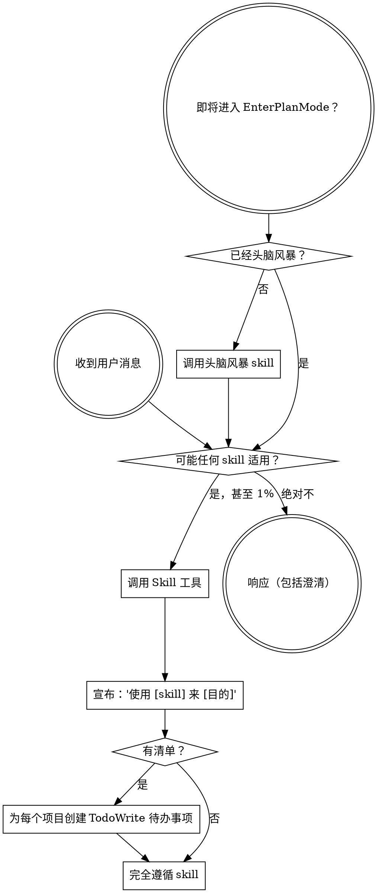

<SUBAGENT-STOP>
如果你作为 subagent 被调用来执行特定任务，请跳过此 skill。
</SUBAGENT-STOP>

<EXTREMELY-IMPORTANT>
如果你认为甚至只有 1% 的机会 skill 可能适用于你正在做的事情，你绝对必须调用该 skill。

如果一个 skill 适用于你的任务，你别无选择。你必须使用它。

这是不可商量的。这不是可选的。你无法通过合理化来摆脱这一点。
</EXTREMELY-IMPORTANT>

## 指令优先级

Superpowers skill 覆盖默认系统提示行为，但**用户指令始终优先**：

1. **用户的显式指令**（CLAUDE.md、GEMINI.md、AGENTS.md、直接请求）- 最高优先级
2. **Superpowers skill** - 覆盖冲突的默认系统行为
3. **默认系统提示** - 最低优先级

如果 CLAUDE.md、GEMINI.md 或 AGENTS.md 说"不要使用 TDD"，skill 说"始终使用 TDD"，请遵循用户的指令。用户处于控制地位。

## 如何访问 Skill

**在 Claude Code 中：**使用 `Skill` 工具。当你调用 skill 时，其内容被加载并呈现给你 - 直接遵循它。永远不要对 skill 文件使用 Read 工具。

**在 Copilot CLI 中：**使用 `skill` 工具。Skill 从已安装的插件自动发现。`skill` 工具的工作方式与 Claude Code 的 `Skill` 工具相同。

**在 Gemini CLI 中：**Skill 通过 `activate_skill` 工具激活。Gemini 在会话开始时加载 skill 元数据，并在需要时激活完整内容。

**在其他环境中：**检查平台文档以了解如何加载 skill。

## 平台适配

Skill 使用 Claude Code 工具名称。非 CC 平台：参见 `references/copilot-tools.md`（Copilot CLI）、`references/codex-tools.md`（Codex）以获取工具等效项。Gemini CLI 用户通过 GEMINI.md 自动加载工具映射。

# 使用 Skill

## 规则

**在任何响应或操作之前调用相关或请求的 skill。**即使只有 1% 的机会 skill 可能适用，你也应该调用 skill 来检查。如果调用的 skill 结果证明不适合该情况，你不需要使用它。

## 危险信号

这些想法意味着停下 - 你正在合理化：

| 想法 | 现实 |
|---------|---------|
| "这只是一个简单的问题" | 问题就是任务。检查 skill。 |
| "我需要先获取更多上下文" | Skill 检查在澄清问题之前进行。 |
| "让我先探索代码库" | Skill 告诉你如何探索。先检查。 |
| "我可以快速检查 git/文件" | 文件缺乏对话上下文。检查 skill。 |
| "让我先收集信息" | Skill 告诉你如何收集信息。 |
| "这不需要正式的 skill" | 如果 skill 存在，就使用它。 |
| "我记得这个 skill" | Skill 会演变。阅读当前版本。 |
| "这不算任务" | 行动 = 任务。检查 skill。 |
| "Skill 是过度杀伤" | 简单的事情会变复杂。使用它。 |
| "我就先做这一件事" | 在做任何事之前先检查。 |
| "这感觉很有效率" | 无纪律的行动浪费时间。Skill 防止这种情况。 |
| "我知道那是什么意思" | 了解概念 ≠ 使用 skill。调用它。 |

## Skill 优先级

当多个 skill 可能适用时，使用此顺序：

1. **流程 skill 优先**（头脑风暴、调试）- 这些确定如何处理任务
2. **实现 skill 其次**（frontend-design、mcp-builder）- 这些指导执行

"让我们构建 X" → 首先头脑风暴，然后实现 skill。
"修复这个 bug" → 首先调试，然后特定领域的 skill。

## Skill 类型

**严格**（TDD、调试）：完全遵循。不要适应远离纪律。

**灵活**（模式）：适应上下文的原则。

Skill 本身会告诉你哪一个。

## 用户指令

指令说做什么，不说如何做。"添加 X"或"修复 Y"并不意味着跳过工作流。
