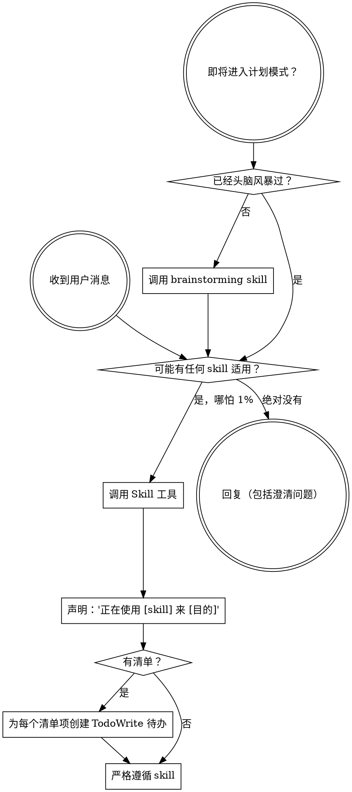

<SUBAGENT-STOP>
如果你作为 subagent 被派发执行特定任务，跳过此 skill。
</SUBAGENT-STOP>

<EXTREMELY-IMPORTANT>
如果你认为某个 skill 有哪怕 1% 的可能性适用于你正在做的事情，你绝对必须调用该 skill。

如果一个 skill 适用于你的任务，你没有选择。你必须使用它。

这是不可协商的。这是不可选的。你不能为逃避找借口。
</EXTREMELY-IMPORTANT>

## 指令优先级

Superpowers skills 覆盖默认系统 prompt 行为，但**用户指令始终优先**：

1. **用户的明确指令**（CLAUDE.md、GEMINI.md、AGENTS.md、直接请求）——最高优先级
2. **Superpowers skills**——在冲突时覆盖默认系统行为
3. **默认系统 prompt**——最低优先级

如果 CLAUDE.md、GEMINI.md 或 AGENTS.md 说"不要使用 TDD"，而某个 skill 说"始终使用 TDD"，遵循用户的指令。用户说了算。

## 如何访问 Skills

**在 Claude Code 中：** 使用 `Skill` 工具。当你调用一个 skill 时，其内容被加载并展示给你——直接遵循它。永远不要对 skill 文件使用 Read 工具。

**在 Copilot CLI 中：** 使用 `skill` 工具。skills 从已安装的插件中自动发现。`skill` 工具的工作方式与 Claude Code 的 `Skill` 工具相同。

**在 Gemini CLI 中：** skills 通过 `activate_skill` 工具激活。Gemini 在会话启动时加载 skill 元数据，并按需激活完整内容。

**在其他环境中：** 查看你平台的文档了解如何加载 skills。

## 平台适配

Skills 使用 Claude Code 工具名称。非 CC 平台：请参阅 `references/copilot-tools.md`（Copilot CLI）、`references/codex-tools.md`（Codex）获取工具等价表。Gemini CLI 用户通过 GEMINI.md 自动获取工具映射。

# 使用 Skills

## 规则

**在任何回复或操作之前，调用相关或请求的 skills。** 哪怕只有 1% 的可能性某个 skill 适用，你也要调用该 skill 来检查。如果调用的 skill 最终证明不适合当前情况，你不需要使用它。

## 危险信号

这些想法意味着停下来——你正在找借口：

| 想法 | 现实 |
|---------|---------|
| "这只是一个简单问题" | 问题就是任务。检查 skills。 |
| "我需要先了解更多上下文" | Skill 检查在澄清问题之前。 |
| "让我先探索代码库" | Skills 告诉你如何探索。先检查。 |
| "我可以快速检查 git/文件" | 文件缺少对话上下文。检查 skills。 |
| "让我先收集信息" | Skills 告诉你如何收集信息。 |
| "这不需要正式的 skill" | 如果存在 skill，就使用它。 |
| "我记得这个 skill" | skills 会演进。阅读当前版本。 |
| "这不算一个任务" | 操作 = 任务。检查 skills。 |
| "用这个 skill 小题大做了" | 简单的事会变复杂。使用它。 |
| "我先做这一件事" | 在做任何事之前先检查。 |
| "这感觉很高产" | 盲目的行动浪费时间。skills 防止这一点。 |
| "我知道那是什么意思" | 知道概念 ≠ 使用 skill。调用它。 |

## Skill 优先级

当多个 skills 可能适用时，按以下顺序使用：

1. **流程类 skills 优先**（brainstorming、debugging）——这些决定了如何着手任务
2. **实现类 skills 其次**（frontend-design、mcp-builder）——这些指导执行

"让我们构建 X" → 先 brainstorming，然后实现类 skills。
"修复这个 bug" → 先 debugging，然后领域相关 skills。

## Skill 类型

**严格的**（TDD、debugging）：严格遵循。不要为了灵活而偏离纪律。

**灵活的**（模式 patterns）：将原则适配到上下文中。

skill 自身会告诉你它是哪种类型。

## 用户指令

指令说的是做什么（WHAT），而不是如何做（HOW）。"添加 X"或"修复 Y"并不意味着跳过工作流。
