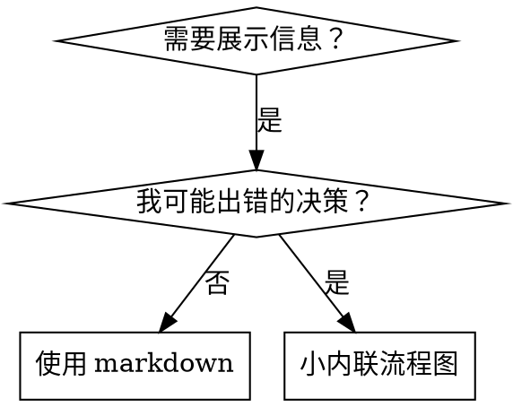

# 编写 Skills

## 概述

**编写 skills 就是将测试驱动开发（TDD）应用于过程文档。**

**个人 skills 存放在 agent 特定的目录中（Claude Code 用 `~/.claude/skills`，Codex 用 `~/.agents/skills/`）**

你编写测试用例（带有 subagent 的压力场景），看着它们失败（基线行为），编写 skill（文档），看着测试通过（agent 遵从），然后重构（堵住漏洞）。

**核心原则：** 如果你没有亲眼看到一个 agent 在没有 skill 的情况下失败，你就不知道这个 skill 是否教了正确的东西。

**必需的背景知识：** 在使用此 skill 之前，你必须理解 superpowers:test-driven-development。那个 skill 定义了基本的 RED-GREEN-REFACTOR 循环。此 skill 将 TDD 适配到文档写作中。

**官方指导：** 关于 Anthropic 官方的 skill 编写最佳实践，请参见 anthropic-best-practices.md。该文档提供了额外的模式和指南，补充了此 skill 中以 TDD 为重点的方法。

## 什么是 Skill？

**Skill** 是一个经过验证的技术、模式或工具的参考指南。Skills 帮助未来的 Claude 实例找到并应用有效的方法。

**Skills 是：** 可重用的技术、模式、工具、参考指南

**Skills 不是：** 关于你如何解决某个问题一次的叙述

## Skills 的 TDD 映射

| TDD 概念 | Skill 创建 |
|-------------|----------------|
| **测试用例** | 带有 subagent 的压力场景 |
| **生产代码** | Skill 文档（SKILL.md） |
| **测试失败（RED）** | Agent 在没有 skill 的情况下违反规则（基线） |
| **测试通过（GREEN）** | Agent 在有 skill 的情况下遵从 |
| **重构** | 堵住漏洞同时保持合规 |
| **先写测试** | 在编写 skill 之前运行基线场景 |
| **看着它失败** | 记录 agent 使用的确切辩解理由 |
| **最少代码** | 编写针对这些具体违规行为的 skill |
| **看着它通过** | 验证 agent 现在遵从 |
| **重构循环** | 发现新的辩解 → 堵住 → 重新验证 |

整个 skill 创建过程遵循 RED-GREEN-REFACTOR。

## 何时创建 Skill

**在以下情况下创建：**
- 技术对你来说不是直观明显的
- 你会在跨项目中再次引用它
- 模式适用广泛（不只是特定项目）
- 其他人会受益

**不要为以下情况创建：**
- 一次性解决方案
- 其他地方已有良好文档的标准实践
- 项目特定的约定（放入 CLAUDE.md）
- 机制性约束（如果可以用 regex/验证强制执行，自动化它——将文档留给判断调用）

## Skill 类型

### 技术
带有步骤可遵循的具体方法（condition-based-waiting、root-cause-tracing）

### 模式
思考问题的方式（flatten-with-flags、test-invariants）

### 参考
API 文档、语法指南、工具文档（office docs）

## 目录结构


```
skills/
  skill-name/
    SKILL.md              # 主要参考（必需）
    supporting-file.*     # 仅在需要时
```

**扁平命名空间** - 所有 skills 在一个可搜索的命名空间中

**为以下内容使用单独的文件：**
1. **重量级参考**（100 行以上） - API 文档、综合语法
2. **可重用工具** - 脚本、工具、模板

**保持内联：**
- 原则和概念
- 代码模式（< 50 行）
- 其他一切

## SKILL.md 结构

**前置元数据（YAML）：**
- 两个必需字段：`name` 和 `description`（有关所有支持的字段，请参见 [agentskills.io/specification](https://agentskills.io/specification)）
- 总计最多 1024 个字符
- `name`：仅使用字母、数字和连字符（无括号、特殊字符）
- `description`：第三人称，仅描述何时使用（而不是它做什么）
  - 以 "Use when..." 开头，聚焦于触发条件
  - 包含具体的症状、情况和上下文
  - **永远不要总结 skill 的过程或工作流**（原因见 CSO 部分）
  - 尽可能保持在 500 个字符以内

```markdown
---
name: Skill-Name-With-Hyphens
description: Use when [specific triggering conditions and symptoms]
---

# Skill 名称

## 概述
这是什么？核心原则用 1-2 句话概括。

## 何时使用
[如果决策不明显，使用小内联流程图]

带症状和用例的列表
何时不使用

## 核心模式（适用于技术/模式）
前后代码对比

## 快速参考
用于扫描常见操作的表格或列表

## 实现
简单模式内联代码
链接到文件以获取重量级参考或可重用工具

## 常见错误
什么会出错 + 修复方法

## 真实世界影响（可选）
具体结果
```


## Claude 搜索优化（CSO）

**对发现至关重要：** 未来的 Claude 需要找到你的 skill

### 1. 丰富的 Description 字段

**目的：** Claude 读取 description 来决定为给定任务加载哪些 skills。使其回答："我应该现在阅读这个 skill 吗？"

**格式：** 以 "Use when..." 开头，聚焦于触发条件

**关键：Description = 何时使用，而不是 Skill 做什么**

description 应该只描述触发条件。不要在 description 中总结 skill 的过程或工作流。

**为什么这很重要：** 测试揭示，当 description 总结了 skill 的工作流时，Claude 可能按照 description 执行而不是阅读完整的 skill 内容。一个说"code review between tasks"的 description 导致 Claude 只做一次审查，即使 skill 的流程图清楚地显示了两次审查（spec 合规性然后是代码质量）。

当 description 被改为仅仅 "Use when executing implementation plans with independent tasks"（没有工作流摘要）时，Claude 正确地阅读了流程图并遵循了两阶段审查过程。

**陷阱：** 总结工作流的 description 创建了一条 Claude 会走的捷径。skill 正文变成了 Claude 跳过的文档。

```yaml
# ❌ 坏：总结了工作流 - Claude 可能按照这个执行而不是阅读 skill
description: Use when executing plans - dispatches subagent per task with code review between tasks

# ❌ 坏：太多过程细节
description: Use for TDD - write test first, watch it fail, write minimal code, refactor

# ✅ 好：只有触发条件，没有工作流摘要
description: Use when executing implementation plans with independent tasks in the current session

# ✅ 好：仅触发条件
description: Use when implementing any feature or bugfix, before writing implementation code
```

**内容：**
- 使用具体的触发条件、症状和情况来表明此 skill 适用
- 描述*问题*（race conditions、inconsistent behavior）而不是*特定语言的症状*（setTimeout、sleep）
- 保持触发条件与技术无关，除非 skill 本身是特定于技术的
- 如果 skill 是特定于技术的，在触发条件中明确说明
- 以第三人称书写（注入到系统 prompt 中）
- **永远不要总结 skill 的过程或工作流**

```yaml
# ❌ 坏：太抽象、模糊、不包含何时使用
description: For async testing

# ❌ 坏：第一人称
description: I can help you with async tests when they're flaky

# ❌ 坏：提到技术但 skill 并不特定于它
description: Use when tests use setTimeout/sleep and are flaky

# ✅ 好：以 "Use when" 开头，描述问题，没有工作流
description: Use when tests have race conditions, timing dependencies, or pass/fail inconsistently

# ✅ 好：特定于技术的 skill，具有明确的触发条件
description: Use when using React Router and handling authentication redirects
```

### 2. 关键词覆盖

使用 Claude 可能搜索的词：
- 错误消息："Hook timed out"、"ENOTEMPTY"、"race condition"
- 症状："flaky"、"hanging"、"zombie"、"pollution"
- 同义词："timeout/hang/freeze"、"cleanup/teardown/afterEach"
- 工具：实际命令、库名称、文件类型

### 3. 描述性命名

**使用主动语态，动词优先：**
- ✅ `creating-skills` 而不是 `skill-creation`
- ✅ `condition-based-waiting` 而不是 `async-test-helpers`

### 4. Token 效率（关键）

**问题：** getting-started 和经常被引用的 skills 加载到每次对话中。每个 token 都很重要。

**目标字数：**
- getting-started 工作流：每个 <150 词
- 频繁加载的 skills：总共 <200 词
- 其他 skills：<500 词（仍需简洁）

**技巧：**

**将细节移到工具帮助中：**
```bash
# ❌ 坏：在 SKILL.md 中记录所有参数
search-conversations supports --text, --both, --after DATE, --before DATE, --limit N

# ✅ 好：引用 --help
search-conversations supports multiple modes and filters. Run --help for details.
```

**使用交叉引用：**
```markdown
# ❌ 坏：重复工作流细节
When searching, dispatch subagent with template...
[20 行重复的指令]

# ✅ 好：引用其他 skill
Always use subagents (50-100x context savings). REQUIRED: Use [other-skill-name] for workflow.
```

**压缩示例：**
```markdown
# ❌ 坏：冗长示例（42 词）
your human partner: "How did we handle authentication errors in React Router before?"
You: I'll search past conversations for React Router authentication patterns.
[Dispatch subagent with search query: "React Router authentication error handling 401"]

# ✅ 好：最小示例（20 词）
Partner: "How did we handle auth errors in React Router?"
You: Searching...
[Dispatch subagent → synthesis]
```

**消除冗余：**
- 不要重复交叉引用的 skills 中的内容
- 不要解释从命令中已显而易见的内容
- 不要包含相同模式的多个示例

**验证：**
```bash
wc -w skills/path/SKILL.md
# getting-started 工作流：每个目标 <150
# 其他频繁加载的：总共目标 <200
```

**根据你做的事或核心洞察命名：**
- ✅ `condition-based-waiting` > `async-test-helpers`
- ✅ `using-skills` 而不是 `skill-usage`
- ✅ `flatten-with-flags` > `data-structure-refactoring`
- ✅ `root-cause-tracing` > `debugging-techniques`

**动名词（-ing）适用于过程：**
- `creating-skills`、`testing-skills`、`debugging-with-logs`
- 主动，描述你正在采取的行动

### 4. 交叉引用其他 Skills

**在编写引用其他 skills 的文档时：**

仅使用 skill 名称，带有明确的需求标记：
- ✅ 好：`**必需子 SKILL:** 使用 superpowers:test-driven-development`
- ✅ 好：`**必需的背景知识:** 你必须理解 superpowers:systematic-debugging`
- ❌ 坏：`See skills/testing/test-driven-development`（不清楚是否是必需的）
- ❌ 坏：`@skills/testing/test-driven-development/SKILL.md`（强制加载，消耗上下文）

**为什么不使用 @ 链接：** `@` 语法立即强制加载文件，在需要之前消耗 200k+ 上下文。

## 流程图使用



**仅在以下情况使用流程图：**
- 不明显的决策点
- 你可能过早停止的过程循环
- "何时使用 A vs B" 决策

**永远不要对以下情况使用流程图：**
- 参考材料 → 表格、列表
- 代码示例 → Markdown 块
- 线性指令 → 编号列表
- 没有语义含义的标签（step1, helper2）

有关 graphviz 样式规则，请参见 @graphviz-conventions.dot。

**为人类搭档可视化：** 使用此目录中的 `render-graphs.js` 将 skill 的流程图渲染为 SVG：
```bash
./render-graphs.js ../some-skill           # 每个图单独
./render-graphs.js ../some-skill --combine # 所有图在一个 SVG 中
```

## 代码示例

**一个出色的示例胜过许多平庸的示例**

选择最相关的语言：
- 测试技巧 → TypeScript/JavaScript
- 系统调试 → Shell/Python
- 数据处理 → Python

**好的示例：**
- 完整且可运行
- 注释良好，解释为什么
- 来自真实场景
- 清晰地展示模式
- 可适配（不是通用模板）

**不要：**
- 用 5+ 种语言实现
- 创建填空模板
- 编写人为构造的示例

你擅长适配——一个好的示例就够了。

## 文件组织

### 自包含 Skill
```
defense-in-depth/
  SKILL.md    # 所有内容内联
```
当：所有内容都适合，不需要重量级参考时

### 带有可重用工具的 Skill
```
condition-based-waiting/
  SKILL.md    # 概述 + 模式
  example.ts  # 可适配的工作助手
```
当：工具是可重用的代码，而不仅仅是叙述时

### 带有重量级参考的 Skill
```
pptx/
  SKILL.md       # 概述 + 工作流
  pptxgenjs.md   # 600 行 API 参考
  ooxml.md       # 500 行 XML 结构
  scripts/       # 可执行工具
```
当：参考材料太大而无法内联时

## 铁律（与 TDD 相同）

```
没有先失败的测试就没有 SKILL
```

这适用于新的 skills 和对现有 skills 的编辑。

在测试之前写 skill？删除它。重新开始。
在没有测试的情况下编辑 skill？同样的违规。

**没有例外：**
- 不是对"简单添加"
- 不是对"只是添加一节"
- 不是对"文档更新"
- 不要保留未经测试的更改作为"参考"
- 不要在运行测试时"改编"
- 删除意味着删除

**必需的背景知识：** superpowers:test-driven-development skill 解释为什么这很重要。相同的原则适用于文档。

## 测试所有 Skill 类型

不同类型的 skill 需要不同的测试方法：

### 强制执行纪律的 Skills（规则/要求）

**示例：** TDD、verification-before-completion、designing-before-coding

**使用以下方式测试：**
- 学术问题：他们理解规则吗？
- 压力场景：他们在压力下遵从吗？
- 多重压力组合：时间 + 沉没成本 + 疲惫
- 识别辩解并添加显式反驳

**成功标准：** Agent 在最大压力下遵循规则

### 技术 Skills（操作指南）

**示例：** condition-based-waiting、root-cause-tracing、defensive-programming

**使用以下方式测试：**
- 应用场景：他们能正确应用技术吗？
- 变化场景：他们处理边界情况吗？
- 信息缺失测试：指令是否有漏洞？

**成功标准：** Agent 成功将技术应用于新场景

### 模式 Skills（心智模型）

**示例：** reducing-complexity、information-hiding 概念

**使用以下方式测试：**
- 识别场景：他们能识别模式何时适用吗？
- 应用场景：他们能使用心智模型吗？
- 反例：他们知道何时不应用吗？

**成功标准：** Agent 正确识别何时/如何应用模式

### 参考 Skills（文档/API）

**示例：** API 文档、命令参考、库指南

**使用以下方式测试：**
- 检索场景：他们能找到正确的信息吗？
- 应用场景：他们能正确使用找到的内容吗？
- 差距测试：常见用例被覆盖了吗？

**成功标准：** Agent 找到并正确应用参考信息

## 跳过测试的常见辩解

| 借口 | 现实 |
|--------|---------|
| "Skill 显然很清晰" | 对你清晰 ≠ 对其他 agent 清晰。测试它。 |
| "它只是一个参考" | 参考可能有差距、不清晰的部分。测试检索。 |
| "测试太过了" | 未经测试的 skills 总有问题。永远如此。15 分钟测试节省数小时。 |
| "出问题我再测试" | 出问题 = agent 无法使用 skill。在部署前测试。 |
| "测试太繁琐" | 测试不如在生产中调试糟糕的 skill 繁琐。 |
| "我确信它很好" | 过度自信保证会有问题。无论如何测试。 |
| "学术审查就够了" | 阅读 ≠ 使用。测试应用场景。 |
| "没有时间测试" | 部署未经测试的 skill 会浪费更多时间在后续修复上。 |

**所有这些都意味着：在部署前测试。没有例外。**

## 防辩解加固 Skills

强制执行纪律的 skills（如 TDD）需要抵抗辩解。Agent 很聪明，在压力下会找到漏洞。

**心理学说明：** 理解说服技术为何有效有助于你有系统地应用它们。请参见 persuasion-principles.md 了解关于权威、承诺、稀缺性、社会认同和团结原则的研究基础（Cialdini, 2021; Meincke 等, 2025）。

### 显式堵住每个漏洞

不要只陈述规则 - 禁止具体的变通方法：

<Bad>
```markdown
在测试之前编写代码？删除它。
```
</Bad>

<Good>
```markdown
在测试之前编写代码？删除它。重新开始。

**没有例外：**
- 不要保留它作为"参考"
- 不要在编写测试时"改编"它
- 不要看它
- 删除意味着删除
```
</Good>

### 解决"精神 vs 字面"的争论

在开头添加基本原则：

```markdown
**违反规则的字面就是违反规则的精神。**
```

这切断了整个"我遵循的是精神"辩解类型。

### 构建辩解表

从基线测试中捕获辩解（参见下面的测试部分）。agent 提出的每个借口都放入表中：

```markdown
| 借口 | 现实 |
|--------|---------|
| "太简单不需要测试" | 简单的代码也会出问题。测试只需 30 秒。 |
| "我稍后测试" | 之后通过的测试什么都证明不了。 |
| "之后测试达到相同目标" | 事后测试 = "这做了什么？" 先测试 = "这应该做什么？" |
```

### 创建红旗列表

让 agent 在辩解时容易进行自我检查：

```markdown
## 红旗 - 停止并重新开始

- 测试之前编写代码
- "我已经手动测试过了"
- "之后测试达到相同目的"
- "这是关于精神而非仪式"
- "这次不同因为..."

**所有这些都意味着：删除代码。用 TDD 重新开始。**
```

### 为违规症状更新 CSO

添加到 description：你即将违反规则的时机症状：

```yaml
description: use when implementing any feature or bugfix, before writing implementation code
```

## Skills 的 RED-GREEN-REFACTOR

遵循 TDD 循环：

### RED：编写失败测试（基线）

在没有 skill 的情况下用 subagent 运行压力场景。记录确切行为：
- 他们做了什么选择？
- 他们使用了什么辩解（逐字）？
- 哪些压力触发了违规？

这是"看着测试失败"——你必须在编写 skill 之前看到 agent 自然地做什么。

### GREEN：编写最小 Skill

编写针对这些具体辩解的 skill。不要为假设案例添加额外内容。

在有 skill 的情况下运行相同场景。Agent 现在应该遵从。

### REFACTOR：堵住漏洞

Agent 找到了新的辩解？添加显式反驳。重新测试直到防弹。

**测试方法：** 参见 @testing-skills-with-subagents.md 了解完整的测试方法：
- 如何编写压力场景
- 压力类型（时间、沉没成本、权威、疲惫）
- 有系统地堵住漏洞
- 元测试技术

## 反模式

### ❌ 叙述性示例
"In session 2025-10-03, we found empty projectDir caused..."
**为什么不好：** 太具体，不可重用

### ❌ 多语言稀释
example-js.js、example-py.py、example-go.go
**为什么不好：** 质量平庸，维护负担

### ❌ 流程图中的代码
```dot
step1 [label="import fs"];
step2 [label="read file"];
```
**为什么不好：** 无法复制粘贴，难以阅读

### ❌ 通用标签
helper1、helper2、step3、pattern4
**为什么不好：** 标签应该有语义含义

## 停止：在转移到下一个 Skill 之前

**编写任何 skill 后，你必须停止并完成部署过程。**

**不要：**
- 在没有测试每个 skill 的情况下批量创建多个 skills
- 在当前 skill 被验证之前转移到下一个 skill
- 因为"批量处理更高效"而跳过测试

**下面的部署检查清单对每个 skill 都是强制性的。**

部署未经测试的 skills = 部署未经测试的代码。这是对质量标准的违反。

## Skill 创建检查清单（TDD 适配）

**重要：使用 TodoWrite 为下面的每个检查清单项目创建待办事项。**

**RED 阶段 - 编写失败测试：**
- [ ] 创建压力场景（对于纪律 skills 需要 3+ 组合压力）
- [ ] 在没有 skill 的情况下运行场景 - 逐字记录基线行为
- [ ] 识别辩解/失败中的模式

**GREEN 阶段 - 编写最小 Skill：**
- [ ] 名称仅使用字母、数字、连字符（无括号/特殊字符）
- [ ] 具有必需 `name` 和 `description` 字段的 YAML 前置元数据（最多 1024 个字符；参见 [spec](https://agentskills.io/specification)）
- [ ] Description 以 "Use when..." 开头并包含具体的触发条件/症状
- [ ] Description 以第三人称书写
- [ ] 全文包含关键词以便搜索（错误、症状、工具）
- [ ] 带有核心原则的清晰概述
- [ ] 处理在 RED 中识别的具体基线失败
- [ ] 代码内联或链接到单独文件
- [ ] 一个出色的示例（非多语言）
- [ ] 在有 skill 的情况下运行场景 - 验证 agent 现在遵从

**REFACTOR 阶段 - 堵住漏洞：**
- [ ] 识别来自测试的新的辩解
- [ ] 添加显式反驳（如果是纪律 skill）
- [ ] 从所有测试迭代中构建辩解表
- [ ] 创建红旗列表
- [ ] 重新测试直到防弹

**质量检查：**
- [ ] 仅在决策不明显时使用小流程图
- [ ] 快速参考表
- [ ] 常见错误部分
- [ ] 无叙述性故事
- [ ] 支持文件仅用于工具或重量级参考

**部署：**
- [ ] 将 skill 提交到 git 并推送到你的 fork（如果已配置）
- [ ] 考虑通过 PR 贡献力量回来（如果广泛有用）

## 发现工作流

未来的 Claude 如何找到你的 skill：

1. **遇到问题**（"tests are flaky"）
3. **找到 Skill**（description 匹配）
4. **扫描概述**（这相关吗？）
5. **阅读模式**（快速参考表）
6. **加载示例**（仅在实现时）

**为此流程优化** - 尽早且经常放置可搜索的术语。

## 底线

**创建 skills 就是将 TDD 应用于过程文档。**

相同的铁律：没有先失败的测试就没有 skill。
相同的循环：RED（基线）→ GREEN（编写 skill）→ REFACTOR（堵住漏洞）。
相同的好处：更好的质量、更少的意外、防弹的结果。

如果你对代码遵循 TDD，就对 skills 也遵循。这是应用于文档的相同纪律。
