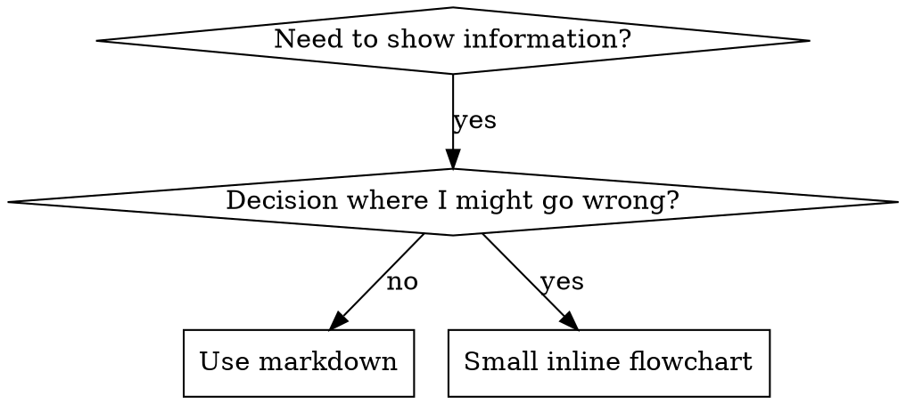

# 编写 Skills

## 概述

**编写 skills 是将测试驱动开发应用于过程文档。**

**个人 skills 存在于 agent 特定的目录中（Claude Code 为 `~/.claude/skills`，Codex 为 `~/.agents/skills/`）**

你编写测试用例（带有 subagents 的压力场景），观察它们失败（基线行为），编写 skill（文档），观察测试通过（agents 遵守），然后重构（关闭漏洞）。

**核心原则**：如果你没有观察 agent 在没有 skill 的情况下失败，你就不知道 skill 是否教授了正确的东西。

**必需背景**：在使用此 skill 之前，你必须理解 superpowers:test-driven-development。该 skill 定义了基本的 RED-GREEN-REFACTOR 周期。此 skill 将 TDD 适应于文档。

**官方指导**：有关 Anthropic 官方的 skill 编写最佳实践，请参阅 anthropic-best-practices.md。本文档提供了额外的模式和指南，补充了此 skill 中专注于 TDD 的方法。

## 什么是 Skill？

**Skill** 是经过验证的技术、模式或工具的参考指南。Skills 帮助未来的 Claude 实例找到并应用有效的方法。

**Skills 是**：可重用的技术、模式、工具、参考指南

**Skills 不是**：关于你如何一次解决问题的叙述

## Skills 的 TDD 映射

| TDD 概念 | Skill 创建 |
|-------------|----------------|
| **测试用例** | 带有 subagent 的压力场景 |
| **生产代码** | Skill 文档（SKILL.md） |
| **测试失败（RED）** | Agent 在没有 skill 的情况下违反规则（基线） |
| **测试通过（GREEN）** | Agent 在存在 skill 的情况下遵守 |
| **重构** | 在保持合规性的同时关闭漏洞 |
| **首先编写测试** | 在编写 skill 之前运行基线场景 |
| **观察它失败** | 记录 agent 使用的确切理由 |
| **最小代码** | 编写解决那些特定违规的 skill |
| **观察它通过** | 验证 agent 现在遵守 |
| **重构周期** | 找到新理由 → 堵塞 → 重新验证 |

整个 skill 创建过程遵循 RED-GREEN-REFACTOR。

## 何时创建 Skill

**创建当**：
- 技术对你来说不明显
- 你会在项目中再次参考它
- 模式广泛适用（非项目特定）
- 其他人会受益

**不创建用于**：
- 一次性解决方案
- 在其他地方有良好文档的标准实践
- 项目特定的约定（放在 CLAUDE.md 中）
- 机械约束（如果可以通过 regex/验证强制，自动化它——将文档留给判断调用）

## Skill 类型

### 技术
具有要遵循的具体步骤的方法（基于条件的等待、根本原因跟踪）

### 模式
思考问题的方式（使用标志扁平化、测试不变量）

### 参考
API 文档、语法指南、工具文档（办公室文档）

## 目录结构


```
skills/
  skill-name/
    SKILL.md              # 主要参考（必需）
    supporting-file.*     # 仅在需要时
```

**扁平命名空间** - 所有 skills 在一个可搜索的命名空间中

**单独文件用于**：
1. **重度参考**（100+ 行）- API 文档、综合语法
2. **可重用工具** - 脚本、实用程序、模板

**保持内联**：
- 原则和概念
- 代码模式（< 50 行）
- 其他所有内容

## SKILL.md 结构

**Frontmatter（YAML）**：
- 两个必需字段：`name` 和 `description`（参见 [agentskills.io/specification](https://agentskills.io/specification) 获取所有支持的字段）
- 最多 1024 个字符总计
- `name`：仅使用字母、数字和连字符（无括号、特殊字符）
- `description`：第三人称，仅描述何时使用（不描述它做什么）
  - 以"Use when"开头，专注于触发条件
  - 包括特定症状、情况和上下文
  - **永远不要总结 skill 的流程或工作流**（参见 CSO 部分了解原因）
  - 如果可能保持在 500 字符以下

```markdown
---
name: Skill-Name-With-Hyphens
description: Use when [特定触发条件和症状]
---

# Skill Name

## 概述
这是什么？核心原则用 1-2 句话。

## 何时使用
[小内联流程图 IF 决策不明显的]

带有症状和用例的项目符号列表
何时不使用

## 核心模式（用于技术/模式）
之前/之后代码比较

## 快速参考
用于扫描常见操作的表或项目符号

## 实现
简单模式的内联代码
链接到文件以进行重度参考或可重用工具

## 常见错误
出错的内容 + 修复

## 实际影响（可选）
具体结果
```


## Claude 搜索优化（CSO）

**对发现至关重要**：未来的 Claude 需要找到你的 skill

### 1. 丰富的描述字段

**目的**：Claude 阅读描述来决定为给定任务加载哪些 skills。使其回答："我现在应该阅读这个 skill 吗？"

**格式**：以"Use when"开头，专注于触发条件

**关键：描述 = 何时使用，而非 Skill 所做内容**

描述应该仅描述触发条件。不要在描述中总结 skill 的流程或工作流。

**为什么这很重要**：测试表明，当描述总结 skill 的工作流时，Claude 可能遵循描述而不是阅读完整的 skill 内容。一个描述说"在任务之间进行代码审查"导致 Claude 进行一次审查，即使 skill 的流程图清楚地显示了两次审查（spec 合规性然后代码质量）。

当描述更改为"Use when executing implementation plans with independent tasks in the current session"（没有工作流总结）时，Claude 正确地阅读了流程图并遵循了两阶段审查流程。

**陷阱**：总结工作流的描述创造了 Claude 将采用的捷径。skill 主体变成了 Claude 跳过的文档。

```yaml
# ❌ 坏：总结工作流 - Claude 可能遵循它而不是阅读 skill
description: Use when executing plans - dispatches subagent per task with code review between tasks

# ❌ 坏：太多流程细节
description: Use for TDD - write test first, watch it fail, write minimal code, refactor

# ✅ 推荐：仅触发条件，没有工作流总结
description: Use when executing implementation plans with independent tasks in the current session

# ✅ 推荐：仅触发条件
description: Use when implementing any feature or bugfix, before writing implementation code
```

**内容**：
- 使用具体的触发器、症状和表明此 skill 适用的情况
- 描述*问题*（竞争条件、不一致的行为）而非*语言特定的症状*（setTimeout、sleep）
- 保持触发器技术不可知，除非 skill 本身是技术特定的
- 如果 skill 是技术特定的，在触发器中明确说明
- 以第三人称编写（注入到系统提示中）
- **永远不要总结 skill 的流程或工作流**

```yaml
# ❌ 坏：太抽象、模糊、不包括何时使用
description: For async testing

# ❌ 坏：第一人称
description: I can help you with async tests when they're flaky

# ❌ 坏：提到技术但 skill 并非特定于它
description: Use when tests use setTimeout/sleep and are flaky

# ✅ 推荐：以"Use when"开头，描述问题，没有工作流
description: Use when tests have race conditions, timing dependencies, or pass/fail inconsistently

# ✅ 推荐：技术特定的 skill 具有明确的触发器
description: Use when using React Router and handling authentication redirects
```

### 2. 关键字覆盖

使用 Claude 会搜索的词：
- 错误消息："Hook timed out"、"ENOTEMPTY"、"race condition"
- 症状："flaky"、"hanging"、"zombie"、"pollution"
- 同义词："timeout/hang/freeze"、"cleanup/teardown/afterEach"
- 工具：实际命令、库名、文件类型

### 3. 描述性命名

**使用主动语态、动词优先**：
- ✅ `creating-skills` 而不是 `skill-creation`
- ✅ `condition-based-waiting` 而不是 `async-test-helpers`

### 4. Token 效率（关键）

**问题**：getting-started 和频繁引用的 skills 加载到每个对话中。每个 token 都很重要。

**目标字数**：
- getting-started 工作流：每个 <150 字
- 频繁加载的 skills：总计 <200 字
- 其他 skills：<500 字（仍然简洁）

**技术**：

**将细节移至工具帮助**：
```bash
# ❌ 坏：在 SKILL.md 中记录所有标志
search-conversations 支持 --text、--both、--after DATE、--before DATE、--limit N

# ✅ 推荐：引用 --help
search-conversations 支持多种模式和过滤器。运行 --help 了解详细信息。
```

**使用交叉引用**：
```markdown
# ❌ 坏：重复工作流细节
搜索时，使用模板 dispatch subagent...
[20 行重复的指令]

# ✅ 推荐：引用其他 skill
始终使用 subagents（节省 50-100 倍上下文）。必需：使用 [other-skill-name] 进行工作流。
```

**压缩示例**：
```markdown
# ❌ 坏：冗长的示例（42 字）
you human partner: "How did we handle authentication errors in React Router before?"
You: I'll search past conversations for React Router authentication patterns.
[Dispatch subagent with search query: "React Router authentication error handling 401"]

# ✅ 推荐：最小示例（20 字）
Partner: "How did we handle auth errors in React Router?"
You: Searching...
[Dispatch subagent → synthesis]
```

**消除冗余**：
- 不要重复交叉引用的 skills 中的内容
- 不要解释从命令中显而易见的内容
- 不要包含同一模式的多个示例

**验证**：
```bash
wc -w skills/path/SKILL.md
# getting-started 工作流：旨在每个 <150
# 其他频繁加载：旨在总计 <200
```

**根据你做的事情或核心洞察命名**：
- ✅ `condition-based-waiting` > `async-test-helpers`
- ✅ `using-skills` 而不是 `skill-usage`
- ✅ `flatten-with-flags` > `data-structure-refactoring`
- ✅ `root-cause-tracing` > `debugging-techniques`

**动名词（-ing）适用于流程**：
- `creating-skills`、`testing-skills`、`debugging-with-logs`
- 主动，描述你正在采取的行动

### 4. 交叉引用其他 Skills

**编写引用其他 skills 的文档时**：

仅使用技能名称，带有明确的要求标记：
- ✅ 推荐：`**必需子技能**：使用 superpowers:test-driven-development`
- ✅ 推荐：`**必需背景**：你必须理解 superpowers:systematic-debugging`
- ❌ 坏：`参见 skills/testing/test-driven-development`（如果不清楚是否需要）
- ❌ 坏：`@skills/testing/test-driven-development/SKILL.md`（强制加载，消耗上下文）

**为什么没有 @ 链接**：`@` 语法立即强制加载文件，在你需要它们之前消耗 200k+ 上下文。

## 流程图使用



**仅对以下情况使用流程图**：
- 不明显的决策点
- 你可能过早停止的流程循环
- "何时使用 A vs B"决策

**切勿对以下情况使用流程图**：
- 参考资料→ 表格、列表
- 代码示例 → Markdown 块
- 线性指令 → 编号列表
- 没有语义意义的标签（step1、helper2）

参见 @graphviz-conventions.dot 了解 graphviz 样式规则。

**为你的人类搭档可视化**：使用此目录中的 `render-graphs.js` 将 skill 的流程图渲染为 SVG：
```bash
./render-graphs.js ../some-skill           # 每个图分别
./render-graphs.js ../some-skill --combine # 所有图在一个 SVG 中
```

## 代码示例

**一个优秀的示例胜过许多平庸的示例**

选择最相关的语言：
- 测试技术→ TypeScript/JavaScript
- 系统调试→ Shell/Python
- 数据处理→ Python

**好的示例**：
- 完整且可运行
- 充分注释解释为什么
- 来自真实场景
- 清楚显示模式
- 准备好适应（不是通用模板）

**不要**：
- 用 5+ 种语言实现
- 创建填空模板
- 编写人为的示例

你很擅长移植——一个优秀的示例就足够了。

## 文件组织

### 自包含 Skill
```
defense-in-depth/
  SKILL.md    # 所有内容内联
```
何时：所有内容都适合，不需要重度参考

### 带有可重用工具的 Skill
```
condition-based-waiting/
  SKILL.md    # 概述 + 模式
  example.ts  # 工作助手以适应
```
何时：工具是可重用代码，而不仅仅是叙述

### 带有重度参考的 Skill
```
pptx/
  SKILL.md       # 概述 + 工作流
  pptxgenjs.md   # 600 行 API 参考
  ooxml.md       # 500 行 XML 结构
  scripts/       # 可执行工具
```
何时：参考材料太大而无法内联

## 铁律（与 TDD 相同）

```
没有先有失败测试的 skill
```

这适用于新技能以及对现有技能的编辑。

在测试之前编写 skill？删除它。重新开始。
在没有测试的情况下编辑 skill？同样的违规。

**没有例外**：
- 不是对于"简单的添加"
- 不是对于"只是添加一个部分"
- 不是对于"文档更新"
- 不要将未经测试的更改保留为"参考"
- 不要在运行测试时"适应"
- 删除意味着删除

**必需背景**：superpowers:test-driven-development skill 解释了为什么这很重要。同样的原则适用于文档。

## 测试所有 Skill 类型

不同的 skill 类型需要不同的测试方法：

### 执行纪律的 Skills（规则/要求）

**示例**：TDD、verification-before-completion、designing-before-coding

**测试用**：
- 学术问题：他们理解规则吗？
- 压力场景：他们在压力下遵守吗？
- 多种压力组合：时间 + 沉没成本 + 疲劳
- 识别理由并添加明确的计数器

**成功标准**：Agent 在最大压力下遵循规则

### 技术 Skills（操作指南）

**示例**：condition-based-waiting、root-cause-tracing、defensive-programming

**测试用**：
- 应用场景：他们能正确应用技术吗？
- 变体场景：他们能处理边界情况吗？
- 缺失信息测试：指令有空白吗？

**成功标准**：Agent 成功地将技术应用于新场景

### 模式 Skills（心理模型）

**示例**：reducing-complexity、information-hiding 概念

**测试用**：
- 识别场景：他们能识别模式何时适用吗？
- 应用场景：他们能使用心理模型吗？
- 反例：他们知道何时不应用吗？

**成功标准**：Agent 正确识别何时/如何应用模式

### 参考 Skills（文档/API）

**示例**：API 文档、命令参考、库指南

**测试用**：
- 检索场景：他们能找到正确的信息吗？
- 应用场景：他们能正确使用他们找到的内容吗？
- 差距测试：常见用例是否覆盖？

**成功标准**：Agent 找到并正确应用参考信息

## 跳过测试的常见理由

| 借口 | 现实 |
|--------|---------|
| "Skill 显然很清楚" | 对你清楚 ≠ 对其他 agents 清楚。测试它。 |
| "这只是一个参考" | 参考可能有空白、不清楚的部分。测试检索。 |
| "测试太过分" | 未经测试的 skills 有问题。总是。15 分钟测试节省数小时。 |
| "如果出现问题我会测试" | 问题 = agents 无法使用 skill。在部署之前测试。 |
| "测试太乏味" | 测试比在生产环境中调试坏 skill 乏味得少。 |
| "我确信它很好" | 过度自信保证问题。无论如何测试。 |
| "学术审查就足够了" | 阅读 ≠ 使用。测试应用场景。 |
| "没时间测试" | 部署未经测试的 skill 会浪费更多时间以后修复它。 |

**所有这些意味着：在部署之前测试。没有例外。**

## 使 Skills 防止合理化

执行纪律的 skills（如 TDD）需要抵抗合理化。Agents 很聪明，会在压力下找到漏洞。

**心理学注意**：理解为什么说服技术有效有助于你系统地应用它们。参见 persuasion-principiles.md 了解研究基础（Cialdini, 2021; Meincke et al., 2025）关于权威、承诺、稀缺性、社会证明和统一原则。

### 显式关闭每个漏洞

不要只陈述规则——禁止特定的变通方法：

<坏>
```markdown
在测试之前编写代码？删除它。
```
</坏>

<推荐>
```markdown
在测试之前编写代码？删除它。重新开始。

**没有例外**：
- 不要将其保留为"参考"
- 不要在编写测试时"适应"它
- 不要看它
- 删除意味着删除
```
</推荐>

### 解决"精神 vs 字母"参数

早期添加基本原则：

```markdown
**违反规则的字母就是违反规则的精神。**
```

这切断了整类"我遵循精神"的合理化。

### 构建合理化表

从基线测试中捕获合理化（参见下面的测试部分）。agents 做出的每个借口都进入表中：

```markdown
| 借口 | 现实 |
|--------|---------|
| "太简单而无法测试" | 简单的代码会破坏。测试需要 30 秒。 |
| "我稍后会测试" | 测试立即通过证明不了什么。 |
| "测试后达到相同的目标" | 测试后 = "这是什么？"测试前 = "这应该做什么？" |
```

### 创建红旗列表

使 agents 容易在合理化时自我检查：

```markdown
## 红旗 - 停止并重新开始

- 测试前的代码
- "我已经手动测试了它"
- "测试后达到相同的目的"
- "这是关于精神而不是仪式"
- "这不同因为..."

**所有这些意味着：删除代码。使用 TDD 重新开始。**
```

### 更新 CSO 以获取违规症状

添加到描述：你即将违反规则的的症状：

```yaml
description: use when implementing any feature or bugfix, before writing implementation code
```

## Skills 的 RED-GREEN-REFACTOR

遵循 TDD 周期：

### RED：编写失败测试（基线）

在没有 skill 的情况下使用 subagent 运行压力场景。记录确切的行为：
- 他们做出了什么选择？
- 他们使用了什么理由（逐字）？
- 哪些压力触发了违规？

这是"观察测试失败"——你必须在编写 skill 之前观察 agents 自然做什么。

### GREEN：编写最小 Skill

编写解决那些特定合理化的 skill。不要为假设情况添加额外内容。

使用 skill 运行相同场景。Agent 现在应该遵守。

### REFACTOR：关闭漏洞

Agent 找到了新的合理化？添加明确的计数器。重新测试直到防弹。

**测试方法**：参见 @testing-skills-with-subagents.md 了解完整的测试方法：
- 如何编写压力场景
- 压力类型（时间、沉没成本、权威、疲劳）
- 系统性地堵塞漏洞
- 元测试技术

## 反模式

### ❌ 叙事示例
"在 2025-10-03 会话中，我们发现空的 projectDir 导致..."
**为什么坏**：太具体，不可重用

### ❌ 多语言稀释
example-js.js、example-py.py、example-go.go
**为什么坏**：质量平庸，维护负担

### ❌ 流程图中的代码
```dot
step1 [label="import fs"];
step2 [label="read file"];
```
**为什么坏**：无法复制粘贴，难以阅读

### ❌ 通用标签
helper1、helper2、step3、pattern4
**为什么坏**：标签应具有语义意义

## 停止：在移动到下一个 Skill 之前

**在编写任何 skill 之后，你必须停止并完成部署流程。**

**不要**：
- 在没有测试每个的情况下批量创建多个 skills
- 在当前经验证之前移动到下一个 skill
- 跳过测试因为"批处理更高效"

**下面的部署检查表对每个 skill 都是强制性的。**

部署未经测试的 skills = 部署未经测试的代码。这是违反质量标准。

## Skill 创建检查表（TDD 适应）

**重要**：使用 TodoWrite 为下面每个检查表项目创建 todos。

**RED 阶段 - 编写失败测试**：
- [ ] 创建压力场景（对于纪律技能为 3+ 种组合压力）
- [ ] 在没有 skill 的情况下运行场景 - 逐字记录基线行为
- [ ] 识别合理化/失败中的模式

**GREEN 阶段 - 编写最小 Skill**：
- [ ] 名称仅使用字母、数字、连字符（无括号/特殊字符）
- [ ] 带有必需 `name` 和 `description` 字段的 YAML frontmatter（最多 1024 字符；参见 [规范](https://agentskills.io/specification)）
- [ ] 描述以"Use when"开头并包括特定触发器/症状
- [ ] 以第三人称编写的描述
- [ ] 贯穿的关键字用于搜索（错误、症状、工具）
- [ ] 带有核心原则的清晰概述
- [ ] 解决在 RED 中识别的特定基线失败
- [ ] 代码内联或链接到单独的文件
- [ ] 一个优秀的示例（不是多语言）
- [ ] 使用 skill 运行场景 - 验证 agents 现在遵守

**REFACTOR 阶段 - 关闭漏洞**：
- [ ] 从测试中识别新的合理化
- [ ] 添加明确的计数器（如果是纪律技能）
- [ ] 从所有测试迭代构建合理化表
- [ ] 创建红旗列表
- [ ] 重新测试直到防弹

**质量检查**：
- [ ] 小流程图仅在决策不明显时
- [ ] 快速参考表
- [ ] 常见错误部分
- [ ] 没有叙述性讲故事
- [ ] 支持文件仅用于工具或重度参考

**部署**：
- [ ] 将 skill 提交到 git 并推送到你的 fork（如果配置）
- [ ] 考虑通过 PR 贡献回去（如果广泛有用）

## 发现工作流

未来的 Claude 如何找到你的 skill：

1. **遇到问题**（"tests are flaky"）
3. **找到 SKILL**（描述匹配）
4. **扫描概述**（这相关吗？）
5. **阅读模式**（快速参考表）
6. **加载示例**（仅在实施时）

**为此流程优化** - 早期和频繁地放置可搜索的术语。

## 结论

**创建 skills 是用于过程文档的 TDD。**

相同的铁律：没有先有失败测试的 skill。
相同的周期：RED（基线）→ GREEN（编写 skill）→ REFACTOR（关闭漏洞）。
相同的好处：更好的质量、更少的意外、防弹的结果。

如果你对代码遵循 TDD，对 skills 也遵循它。这是应用于文档的相同纪律。
